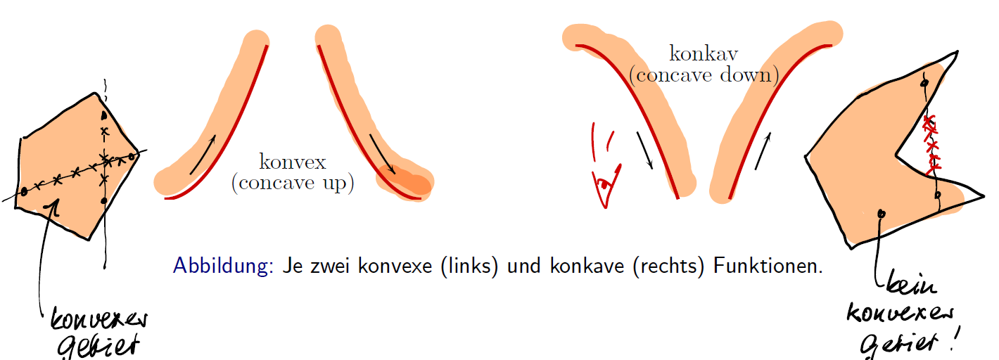

# Mathe Zusammenfassung

## Grundlagen
### Algebra


### Sympy Solve()
```python
import sympy as sp
x = sp.symbols("x")
expr = -1/3 * x ** 2 + 13/3 * x + 16
sp.solve(expr)
```

#### Brüche
$\frac{1}{x^2}\frac{1}{x^3}=\frac{1}{x^5}$\
$\frac{1}{cos(x)^2}tan(x)=\frac{1}{cos(x)^2}\frac{sin(x)}{cos(x)}=\frac{sin(x)}{cos(x)^3}$\
$\frac{\frac{a}{b}}{\frac{c}{d}}=\frac{a*d}{b*c}$

### Zahlen


## Funktionen
**Definitionsbereich/Urbildbereich**: D(f), Menge der für x einsetzbaren Zahlen \
**Wertebereich/Bildbereich**: W(f), Menge aller Funktionswerte y\
**Pol**: eine einpunktige Definitionsläcke einer Funktion, wenn die Funktionswerte in jeder Umgebung des Punktes beliebig gross werden (Nenner wird Null).\
**Asymptote**: eine Gerade, die sich dem Graphen einer Funktion beliebig genau annhähert.\
**Gerade Funktion**: f ist achsensymmetrisch bezüglich der y-Achse und es gilt:\
$f(-x) = f(x), \forall \in D(f)$ (für alle x im Definitionsbereich von f).\
**Ungerade Funktion**: f ist punktsymmetrisch bezüglich dem Ursprung und es gilt:\
$f(-x) = -f(x), \forall \in D(f)$


**Beschränktheit**: Eine Funktion heisst beschränkt, wenn sie nach oben, unten oder beides beschränkt ist.\
**Monotonie**: Eine Funktion heisst streng monoton wachsend/ fallend, wenn sie immer steigt/sinkt. Eine Funktion heisst monoton wachsend, wenn sie nie sinkt.

### Intervalle
Eine eckige Klammer gibt an, dass die entsprechende Intervallsgrenze zum Intervall gehört.\
Eine runde Klammer gibt an, dass die entsprechende Intervallsgrenze nicht zum Intervall
gehört.\
Gelegentlich ist es nützlich für die Intervallgrenzen auch $-\infty$ bzw. $\infty$ zuzulassen:\
$\Reals = (-\infty,\infty), \Reals+ = (0,\infty), \Reals- = (-\infty, 0), \Reals_0+ = [0,\infty), \Reals_0- = (-\infty, 0 ]$

$I = [a, b] = {x \in \Reals  | a <= x <= b}$ : **abgeschlossenes Intervall**\
$I = (a, b) = {x \in \Reals | a < x < b}$ : **offenes Intervall**\
$I = (a, b] = {x \in \Reals | a < x <= b}$ : **halboffenes Intervall**


### Lineare Funktionen
$y = mx + b$

**Proportionalität, Steigung**: Für a > 0 liegt die Gerade im I. und III. Quadranten und ist steigend. Für a < 0 liegt die Gerade im II. und IV. Quadranten und ist fallend. Für a = 0 ist die Gerade gleich der
x-Achse! Für a > 0 steigt die Gerade von links nach rechts, für a < 0 fällt sie.\
Ist die Steigung negativ, fällt die Gerade. Ist die Steigung Null, dann hat man eine
horizontale Gerade.\
Beispiel: y=3 -> horizontale Gerade

**Differenzenquotient**: Steigung, $m = \frac{y_2 - y_1}{x_2 - x_1}$\
**Steigung der Senkrechten**: $m_{senkrecht} = \frac{-1}{m}$\
**Schnittpunkt zweier Geraden**: \
Vorgehen: Funktionen gleichsetzen und nach x auflösen, anschliessend in eine der Funktionen einsetzen. 
1. Genau eine Lösung
2. Unendlich viele Lösungen
3. Keine Lösung\

**BEISPIELE**\
Punkt(a,b)\
$y_2-c=m(x-a)$

Wenn es eine Glichung ist, einfach nach $y$ auflösen:\
$7y+12x-2=0 \rArr y=-\frac{12x}{7}+\frac{2}{7}$

Punkt(2,1), $f(x)y=5x-3$\
$\frac{-x}{5}x-3 \rArr 1 = -\frac{2}{5}+b \rArr b=1+\frac{2}{5}$

**Schnittpunkt Polynom und Gerade**:\
Schneidet man ein Polynom mit einer Gerade, dann ist die Anzahl der Schnittpunkte höchstens gleich dem Grad des Polynoms.\
Vorgehen: Bei der Berechnung setzt man wieder zu Beginn die Funktionswerte gleich. Anschließend bringt man alles auf eine Seite und bestimmt die  Nullstellen  der neuen Funktion, falls nötig mit der Mitternachtsformel  oder duch Polynomdivision.
**Mitternachtsformel**: $\frac{-b\pm\sqrt{b^2-4ac}}{2a}$

### Quadratische Funktionen
**Stammfunktion**: $y = ax^2 + bx + c$\
a: Öffnung
c: y-Achsenabschnitt

### Exponentialfunktionen
Eine Funktion der $f(x) = a · b^x$ mit $b > 0$ und $b \ne 1$ heisst Exponentialfunktion. a heisst Anfangswert und b heisst Wachstumsfaktor. Für Definitions- und Wertebereich gilt: \
$D(f) =\Reals, W(f) = \Reals+.$\
**exponentielles Wachstum**: $A_t=A_0 *a^t$\
$A_0$: Ausgangsgrösse im Zeitpunkt $t=0$, $a=1 \pm \frac{p}{100}$, p:prozentuale Zu-/Abnahme
**Stammfunktion**: $y = a * e^{b*x}$\
$a^x = b  |  x=\log_a(b)$\
Exp: sehr schnelles Wachstum\
Log: sehr langsames Wachstum\
Beispiel: $y =log_{10}x \iff x=10^y$\
$y=log_ex =lnx \iff x = e^y = \exp(y)$
1. $a^xa^y = a^{x+y}$
2. $(a^x)^y=a^{xy}$
3. $a^{-1}=\frac{1}{a^x}$
4. $a^xb^x=(ab)^x$


### Logarithmusfunktion
Die Logarithmusfunktion ist die Umkehrfunktion der Exponentialfunktion, gespiegelt an der Winkelhalbierenden $y=x$\
Die Logarithmusfunktionen sind nur für $x > 0$, d.h. nur in $\Reals+$ definiert
1. $log_a (u*v)=log_a u+log_a v$
2. $log_a (\frac{u}{v})=log_a u-log_a v$
3. $log_a (b^n )=n*log_a b$

$log_a 1=0$\
$log_a a=1$\
$a^{log_ab}=b$\
$log_a (a^n )=n$\
$log_{10} = log$

### Konvex - konkav
Der Graph der Funktion f heisst konvex, falls er eine Linkskurve durchführt, wenn man von
links nach rechts geht. Andernfalls heisst der Graph konkav. Eine Gerade ist weder konvex noch
konkav.


### Potenzfunktionen
Stammfunktion: $y= a(x-u)^n +b$\
$n>0$: gerade: Parabel, $n$ ungerade: Wendeparabel\
$n<0$: Hyperbel\
$n \in \N$: Monom\
Wachstum: langsamer als die Exponentialfunktion

### Polynome, Ganzrationale Funktionen
Stammfunktion: $a_nx^n + a_{n-1}x^{n-1}+...+a_1x+a_0$\
$a_n$: Koeffizient\
$n$: Grad des Polynoms. Die höchstens Potenz bestimmt den Grad des Polynoms.\
$x$: unabhängige Variable\
$y$: abhängige Variable\
Der Faktor k vor dem Produkt der Nullstellen bewirkt eine Streckung oder Stauchung des
Graphen in y-Richtung und bei einem Vorzeichenwechsel wird der Graph an der x-Achse gespiegelt.

### Rationale Funktionen
Rationale Funktionen sind Quotienten von Polynomen p und q.\
Stammfunktion: $y=r(x)=\frac{p(x)}{q(x)}$

### Verschieben von Funktionen
$f(x)=a*sin⁡(b*(x+c))+d$                
$a$: strecken an Y-Achse mit Faktor $a$\
$b$: stauchen an X-Achse mit Faktor $b$\
$c$: verschieben nach links um $c$\
$d$: verschieben nach oben um $d$

**Merkregel**: Will man den Graph der Funktion $y = f(x)$ vom Ursprung in den Punkt (a, b) verschieben und zusätzlich in Richtung der y-Achse um den Faktor $\alpha$ skalieren (stauchen/strecken), dann lautet die neue Funktion:\
$y - b = \alpha f(x - a) \iff y = \alpha f(x - a) + b.$

Gegeben sei die Funktion $y = f(x)$
1. Multiplikation einer Funktion $f(x)$ mit einer Konstanten $c \in \Reals$ dehnt den Graphen vertikal (falls $c > 1$) oder staucht ihn vertikal (falls $0 < c < 1$). Ein negatives Vorzeichen ($c < 0$) spiegelt den Graphen zusätzlich an der x-Achse.
2. Ersetzt man $y$ durch $y - b$ wird der Graph um $b$ nach oben verschoben (falls $b > 0$), bzw. nach unten (falls $b < 0$).
3. Ersetzt man $x$ durch $x - a$ wird der Graph um $a$ nach rechts verschoben (falls $a > 0$),
bzw. nach links (falls $a < 0$).

### Nullstellen
$x_0: y=f(x_0)=0$\
**Nullstellenform**: $y=a(x-x_1)(x-x_2)$

### Asymptote
**vertikale Asymptote**: Nenner = 0 setzen\
**horizontale Asymptote**: \
Zählergrad > Nennergrad => Asymptote bei $y=0$, Beispiel: $\frac{2*(x^0)}{x}$\
Zählgrad = Nennergrad => $\frac{4x^2}{2x^2}=\frac{4}{2}=>y=2$
**schiefe Asymptote**: Zählergrad um 1 grösser als Nennergrad -> Polynomdivision\
Beispiel: \
\
siehe anderes Beispiel: https://www.gut-erklaert.de/mathematik/polynomdivision.html

### Zusammengesetzte Funktion
Funktion 1: $A=f(r)=\pi r^2$\
Funktion 2: $r = g(t) = 1 + t$\
Es gilt: $A = f(g(t)) = (f \circ g)=\pi(1+t)^2$\
$f$ ist die äussere Funktion (welche zuletzt angewendet wird) und $g$ die innere Funktion (welche zuerst angewendet wird).\
Bei folgenden Beispielen gilt $u(x)$ als äussere Funktion und $v(x)$ als innere Funktion.\
**Klammer**:  $f(x) = 2*(x^2-4)^{10}$\
$u(x)= 2*x^{10}, v(x) =x^2-4$\
**Wurzel**: $f(x)=\sqrt{x-1} = (x-1)^{\frac{1}{2}}$\
$u(x)= \sqrt{x}, v(x) =x-1$\
**Exponent**: $f(x) = 7*3^{x^2-1}$\
$u(x) = 7*3^x,v(x)=x^2-1$\
Darstellung im Venndiagram der Funktion $e^{\cos(x^2-1)}$:


### Umkehrfunktionen
Beachte: $f^{-1}$ steht für die Umkehrfunktion von f, d.h. $f^{-1} \ne \frac{1}{f}$\
Umkehrfunktion existiert, falls es zu jedem $y$ genau ein $x$ gibt. Oder anders: Falls der Graph höchstens einmal von Parallelen zur x-Achse geschnitten wird. \
$f^{-1} =x \iff f(x) =y$\
**injektiv**: zu jedem y höchstens 1 x-Wert.\
**surjektiv**: zu jedem y mindestens 1 x-Wert.\
**bijektiv**: Funktion ist surjektiv und injektiv.\
Vorgehen: Gleichung nach x auflösen und x mit y vertauschen\

Beispiele:\


### Bogenlänge/Radiant, Trigonometrie


## Folgen, Reihen
Eine Folge kann wie folgt beschrieben werden:
1. Aufzählen der Glieder
2. Bildungsgesetz (explizit): $a_n$ für n-ten Wert direkt erkennbar
3. Rekursionsvorschrift (implizit): Ergibt sich auf vorherigen Gliedern

### Überprüfung auf Beschränktheit, Monotonie und Konvergenz
1. Grenzwert berechnen (oder zumindest verdächtigen)
2. Monotonie prüfen
   1. $a_{n+1}-a_n>0 \iff$ **monoton wachsend**
   2. $a_{n+1}-a_n<0 \iff$ **monoton fallend**
3. Beschränktheit prüfen (obere oder untere Grenze)

### Arithmetische Folge
Differenz d zweier beliebiger aufeinanderfolgender Glieder $a_n$ und $a_{n+1}$ sind konstant.\
Eindeutig beschrieben durch 2 Grössen: 
1. durch ein beliebiges Glied $a_n$ und die Differenz d, oder
2. durch zwei beliebige Glieder $a_n$ und $a_{n+k}$.

$d=a_{n+1}-a_n$\
$a_n=a_1+(n-1)d$

### Summe der Glieder einer Arithmetischen Folge
$a_1 + a_2 + ... + a_n = \sum\limits_{k=1}^na_k = na_1 + d\frac{n(n-1)}{2}=n\frac{a_1+a_n}{2}$\
$n$: Anzahl Glieder\
$a_1$: 1. Glied\
$a_n$: letztes Glied

### Geometrische Folge
Quotient q zweier beliebiger aufeinanderfolgenden Glieder $a_n$ und $a_{n+1}$ konstant sind.\
Eindeutig beschrieben durch 2 Grössen:
1. durch ein beliebiges Glied $a_n$ und den Quotienten q, oder
2. durch zwei beliebige Glieder $a_n$ und $a_{n+k}$\
$q = \frac{a_{n+1}}{a_n}$

### Rechnen mit Folgen
1. Eine Folge ($a_n$) multipliziert man mit einer (reellen) Zahl $\lambda$, indem man jedes Glied der Folge mit dieser Zahl multipliziert: $\lambda(a_n) = (\lambda a_n)$
2.  Zwei Folgen ($a_n$) und ($b_n$) addiert man, indem man entsprechende Glieder addiert: $(a_n) + (b_n) = (a_n + b_n)$
3. Ein Folge ($a_n$) hiesst konstante Folge, falls $a_n = c \in \R, \forall n \in \N$.

**Streng monoton zunehmend**: Jedes Glied ist grösser als das vorherige Glied ($a_{n+1} > a_n$)\
**beschränkt**: Glieder sind auf einen gewissen Bereich ("Teppich") eingeschränkt, wird auch mit Epsilon $\epsilon$ gekennzeichnet: $|a_n| \leqslant c$

### Spezielle Summen


### Grenzwert einer Folge - Rechenregeln
Falls die Folge ($a_n$) gegen a und die Folge ($b_n$) gegen b konvergiert (annähert)
1. $\lim\limits_{n\rightarrow\infty}(a_n+b_n)=\lim\limits_{n\rightarrow\infty}(a_n)+\lim\limits_{n\rightarrow\infty}(b_n)=a+b$
2. $\lim\limits_{n\rightarrow\infty}(a_n*b_n)=\lim\limits_{n\rightarrow\infty}(a_n)*\lim\limits_{n\rightarrow\infty}(b_n)=a*b$
3. $\lim\limits_{n\rightarrow\infty}(\frac{a_n}{b_n})=\frac{\lim\limits_{n\rightarrow\infty}(a_n)}{\lim\limits_{n\rightarrow\infty}(b_n)}=\frac{a}{b}$ bei $b \ne 0$ und $b_n \ne 0$

#### Trick - Erweitern


#### Trick - Auseinandernehmen
Beispiel:\


#### Natürliche Grenzwerte
1. $\lim\limits_{n\rightarrow\infty}(1+\frac{\alpha}{n})^n=e^{\alpha}$, $\forall \alpha \in \R$
2. $\lim\limits_{n\rightarrow\infty}(n^ke^{-n})=0$, $\forall k \in \N$
3. $\lim\limits_{n\rightarrow\infty}(\sqrt[n]{n})=1$ 
4. $\lim\limits_{n\rightarrow\infty}(\sqrt[n]{a})=1$, $(a>0)$
5. $\lim\limits_{n\rightarrow\infty}(\sqrt[n]{a_1^n+...+a_p^n})$=max{$a_1,...,a_p$}, ($a_k>0, k=1,...,p$)

### Folge der n-ten Partialsummen
Bedeutet n Glieder addieren. Mithilfe der Summe einer endlichen geometrischen Reihe.\
$a_1+a_{1q}+a_{1q^2}+...+a_{1q^{n-1}}=\sum\limits_{k=0}^{n-1}a_1q^k=a_1\frac{q^n-1}{q-1}$\
Für den Grenzwert dieser Folge findet man: \
$s=\lim\limits_{n \rightarrow \infty}s_n=\lim\limits_{n \rightarrow \infty} a_1\frac{1-q^n}{1-q}=\frac{a_1}{1-q}\lim\limits_{n\rightarrow \infty}(1-q^n)$\
$a_1$: 1. Glied, $n$: Anzahl Glieder, $q$: Quotient\
Bei Anwendung der Formel kann $n\rightarrow \infty$ verwendet werden, so erhält man unendlich viele Glieder.\
Falls Grenzwert exisitert:\
$\sum\limits_{k=1}^{\infty}a_k=\lim\limits_{n\rightarrow\infty}s_n=\lim\limits_{n\rightarrow\infty}\sum\limits_{k=1}^{n}a_k$\
Unendliche geometrische Reihe: \
$a_1+a_{1q}+a_{1q^2}+a_{1q^3}+...=\sum\limits_{k=0}^{\infty}a_1q^k=\frac{a_1}{1-q}$ falls $|q|<1$\

### Harmonische Reihe
$\sum\limits_{k=1}^{\infty}\frac{1}{k}=\lim\limits_{n\rightarrow\infty}(1+\frac{1}{2}+\frac{1}{3}+...+\frac{1}{n})$

### Konvergenzkriterien
Es muss unbedingt unterschieden werden zwischen der Reihe $\sum\limits_{k=1}^{\infty}a_k$ und der Folge der Glieder dieser Reihe $(a_k) =(1,\frac{1}{2},\frac{1}{3},...)$.\
  * Falls die Reihe $\sum\limits_{k=1}^{\infty}a_k$ konvergiert, dann gilt $\lim\limits_{k\rightarrow\infty}a_k=0$ (die Glieder einer
konvergenten Reihe bilden eine Nullfolge). (Die Reihe 1+2+3+4+5 konvergiert nicht, da die Glieder dieser Reihe keine Nullfolge bilden)
  * Bilden die Glieder einer Reihe keine Nullfolge divergiert die Reihe.
  * Bilden die Glieder einer Reihe eine Nullfolge, dann kann die Reihe konvergieren oder divergieren. (geom./harm. Reihe, bspw. ($\frac{1}{\sqrt{1}}+\frac{1}{\sqrt{2}}+\frac{1}{\sqrt{3}}+\frac{1}{\sqrt{4}}+..., p=\frac{1}{2}$)
  * Die Reihe $\sum\limits_{k=1}^{\infty}\frac{1}{k^p}$ konvergiert für $p > 1$ und divergiert für $p \leqslant 1$. Bspw. ($\frac{1}{1}+\frac{1}{2}+\frac{1}{3}+\frac{1}{4}+...$) konvergiert.

**Absolute Konvergenz**: Die Reihe $\sum\limits_{k=1}^{\infty}a_k$ heisst absolut konvergent, falls die Reihe $\sum\limits_{k=1}^{\infty}|a_k|$ konvergiert. Konvergiert die 1. Reihe aber nicht die 2. Reihe, dann nennt man die Reihe **bedingt
konvergent**. Falls eine Reihe absolut konvergiert, dann konvergiert sie.

#### Quotientenkriterium
Sei $\sum\limits_{k=0}^{\infty}a_k$ eine Reihe mit Gliedern, die nicht verschwinden und $\rho = \lim\limits_{k\rightarrow\infty}(\frac{|a_{k+1}|}{|ak|})$. Dann gilt:
1. Falls $\rho < 1$ dann konvergiert die Reihe (sogar) absolut
2. Falls $\rho > 1$ dann divergiert die Reihe (sogar) absolut
3. Falls $\rho = 1$ dann kann die Reihe sowohl konvergieren wie auch divergieren (weitere Untersuchungen sind nötig).

#### Wurzelkriterium (optional)
Sei $\sum\limits_{k=0}^{\infty}a_k$ und $\rho = \lim\limits_{k\rightarrow\infty}(\sqrt[k]{|a_k|})$. Dann gilt:
1. Falls $\rho < 1$ dann konvergiert die Reihe (sogar) absolut
2. Falls $\rho > 1$ dann divergiert die Reihe (sogar) absolut
3. Falls $\rho = 1$ dann kann die Reihe sowohl konvergieren wie auch divergieren (weitere Untersuchungen sind nötig).
   
#### Majorantenkriterium (optional)
Sei $\sum\limits_{k=0}^{\infty}a_k$ eine konvergente Reihe und es gelte $|bn| \leqslant a_n$ ab einer festen Gliednummer $n_0$. Dann konvergiert auch die Reihe
$\sum\limits_{k=0}^{\infty}|b_k|$

#### Leibnizkriterium (für alternierende Reihen)
Ist ($a_k$) eine positive, monoton fallende Nullfolge, dann konvergiert die alternierende Reihe $\sum\limits_{k=0}^{\infty}(-1)^ka_k$ . Fehler beim Abbruch nach $n$ Gliedern:
$|\sum\limits_{k=0}^{\infty}(-1)^ka_k-\sum\limits_{k=0}^{n-1}(-1)^ka_k|\leqslant a_n$

### Konvergenz Rechenregeln
1. Notwendige Bedingung, damit die Reihe $\sum\limits_{n=1}^{\infty}a_n$ konvergiert ist, dass ihre Glieder eine Nullfolge bilden, d.h. $\lim\limits_{n\rightarrow\infty}a_n = 0$
2. Eine konvergente Reihe bleibt konvergent, wenn man endlich viele Glieder verändert,
weglässt oder dazunimmt.
3. Eine konvergente Reihe darf gliedweise mit einer Konstanten $c \in \R$ multipliziert werden, wobei gilt\ 
$c*\sum\limits_{n=1}^{\infty}a_n=\sum\limits_{n=1}^{\infty}c*a_n$
4. Die Summe (Differenz) zweier konvergenter Reihen ist konvergent wobei gilt\
$\sum\limits_{n=1}^{\infty}a_n \pm \sum\limits_{n=1}^{\infty}b_n= \sum\limits_{n=1}^{\infty}(a_n \pm b_n)$   

### Summenformeln
Alle drei Beispiele anhand von $n$, $n^2$, $n^3$ 1-100:
#### Normal
Summe von 1 bis 100:\
$S=\sum\limits_{k=1}^n\frac{n}{2}(n+1)$

#### Quadratisch
Summe von $1^2$ bis $100^2$:\
$S=\sum\limits_{k=1}^n\frac{n}{6}(n+1)(2n+1)$

#### Kubisch
Summe von $1^3$ bis $100^3$:\
$S=\sum\limits_{k=1}^n\frac{n^2(n+1)^2}{4}$

## Grenzwerte, Stetigkeit
### Tangentenproblem (Annäherung)
Sekante (Linie durch 2 Punkte) betrachten, und einer der Punkte entlang des Graphen immer näher an den anderen Punkt setzen. So erhält man die Tangente

### Flächenproblem (Annäherung)
Fläche in Rechtecke einteilen und Breite der Rechtecke gegen 0 gehen lassen.

### Grenzwerte
Unterscheiden zwischen links- und rechtsseitiger Grenzwert, oft bei bspw. $|x|$. Wenn bei beiden das Gleiche rauskommt ist es der Grenzwert, **zweiseitiger** oder auch **einfacher** Grenzwert genannt.\
$\lim\limits_{x\rightarrow a^-}f(x)=\lim\limits_{x\rightarrow a^+}f(x)$

#### Linksseitiger Grenzwert
Grenzwert, wenn man von links annähert.\
$\lim\limits_{x\rightarrow a^-}f(x)$

#### Rechtsseitiger Grenzwert
Grenzwert, wenn man von rechts annähert.\
$\lim\limits_{x\rightarrow a^+}f(x)$

#### Uneigentlicher Grenzwert
Grenzwerte, die unendlich sind. D.h, $f(x)$ wächst über alle Grenzen wenn man x gegen a gehen lässt. Kann auch bei links- und rechtsseitigen Grenzwerten vorkommen.\
$\lim\limits_{x\rightarrow a}f(x)=\infty$ \
Kann auch bei links- und rechtsseitigen Grenzwerten vorkommen.\
$\lim\limits_{x\rightarrow a^+}f(x)=-\infty$ oder $\lim\limits_{x\rightarrow a^-}f(x)=+\infty$

#### Grundlegene Grenzwerte

1. $\lim\limits_{x\rightarrow a}k=k$ \
Der Grenzwert einer Konstante ist die Konstante selber.
2. $\lim\limits_{x\rightarrow a}x=a$\
Der Grenzwert von x wenn sich x einer Konstante nähert ist die Konstante selber.
3. $\lim\limits_{x\rightarrow 0^-}\frac{1}{x}=-\infty$
4. $\lim\limits_{x\rightarrow 0^+}\frac{1}{x}=\infty$

#### Rechenregeln Grenzwerte
Diese Regeln gelten nur, falls die einzelnen Grenzwerte existieren!
1. $\lim\limits_{x\rightarrow a}(\mu f(x) \pm \nu g(x))=\mu \lim\limits_{x\rightarrow\ a}f(x)+\nu \lim\limits_{x\rightarrow a}g(x)=\mu L_1 \pm \nu L_2$
2. $\lim\limits_{x\rightarrow a}(f(x)g(x))=\lim\limits_{x\rightarrow\ a}f(x)\lim\limits_{x\rightarrow a}g(x)=L_1L_2$
3. ist $L_2 \ne 0$ und g in einer Umgebung von a verschieden von 0, dann ist der Grenzwert des Quotienten gleich dem Quotient des Grentwertes\
$\lim\limits_{x\rightarrow a}(\frac{f(x)}{g(x)})=\frac{\lim\limits_{x\rightarrow\ a}f(x)}{\lim\limits_{x\rightarrow a}g(x)}=\frac{L_1}{L_2}$

#### Weitere Rechenregeln für Grenzwerte
  * $\lim\limits_{x\rightarrow a}x^n=(\lim\limits_{x\rightarrow a}x)^n=a^n$
  * $\lim\limits_{x\rightarrow a}(f(x))^n=(\lim\limits_{x\rightarrow a}f(x))^n$
  * Für ein Polynom $p(x) = c_0 + c_1x + ··· + c_nx^n = \sum\limits_{k=0}^nc_kx^k$ gilt: \
  $\lim\limits_{x\rightarrow a}p(x)=p(x) = c_0 + c_1a + ··· + c_na^n=p(a)$
  * Für eine rationale Funktion $r(x) = \frac{p(x)}{q(x)}$ (dabei sind $p(x)$ und $q(x)$ Polynome) und eine $a \in \R$ gilt:\
      1.  Falls $q(a) \ne 0$, dann ist $\lim\limits_{x \rightarrow a}r(x)=r(a)$
      2.  Falls $q(a) = 0$ und $p(a) \ne 0$, dann existiert $\lim\limits_{x \rightarrow a}r(x)=r(a)$ nicht
      3.  Falls $q(a) = 0$ und $p(a) = 0$, dann kann der Grenzwert existieren, muss aber nicht
  * Sei $a \in \R \cup$ {$-\infty, \infty$}. Gilt dann $\lim\limits_{x\rightarrow c}g(x)=L$ und ist f im Punkt L stetig, dann gilt:
    * $\lim\limits_{x\rightarrow a}f(g(x)) = f(\lim\limits_{x\rightarrow a}g(x))$
    * insbesondere: $\lim\limits_{x\rightarrow a}|g(x)| = |\lim\limits_{x\rightarrow c}g(x)|$, falls $\lim\limits_{x\rightarrow a}g(x)$ existiert

#### Stückweise definierte Funktion
Eine Funktion, die unterschiedlich definiert ist. Ist mit einem Deifnitionsbereich versehen.
Beispiel:\

Aufzeichnen, falls man es sich nicht vorstellen kann.\
Falls nötig, Grenzwert ausrechnen. Schauen, in welchen Definitionsbereich der Wert für x fällt.

#### Squeezing-Theorem
Liegt eine Funktion $f(x)$ zwischen zwei Funktionen $g(x)$ und $h(x)$, und ist der Grenzwert der beiden Funktionen gleich $L$, so ist auch der Grenzwert der Funktion $f(x)$ $L$.\
$g(x) \leqslant f(x) \leqslant h(x)$ und $\lim\limits_{x\rightarrow c}g(x) = \lim\limits_{x\rightarrow c}h(x)=L$\
$\lim\limits_{x\rightarrow c}f(x)=L$


### Stetigkeit
Salopp: eine Funktion f heisst stetig, wenn man deren Graphen zeichnen kann, **ohne den
Stift absetzen zu müssen**. Eine Funktion heisst stetig, falls sie überall, d.h. $\forall x \in D(f)$ stetig ist. \
f ist stetig in a, falls\
$\lim\limits_{x\rightarrow a}f(x)=f(a)$

#### Stetigkeit von Funktionen
  * Summe u. Differenz stetiger Funktionen sind stetig.
  * Der Quotient zweier stetiger Funktionen ist dort stetig, wo der Nenner nicht
verschwindet.
  * Polynome $P(x) = \sum\limits_{k=0}^n a_kx^k$ sind stetig
  * Rationale Funktionen $r(x) = \frac{P(x)}{Q(x)}$ sind dort stetig, wo das Nennerpolynom $Q(x)$ nicht verschwindet.
  * Sinus- $(sin x)$ und Kosinusfunktion $(cos x)$ sind stetig.
  * Der Tangens ($tan x = \frac{sin x}{cos x}$) ist stetig, falls {cosx \ne 0$, d.h. falls $x \ne \frac{\pi}{2} + k\pi, k \in \Z$.
  * Exponential- und Logarithmusfunktion sind in ihren Definitionsbereichen stetig
  * Zusammensetzung stetiger Funktionen ist stetig.
  * Eine zusammengesetzte Funktionen kann dort unstetig sein, wo eine der verwendeten
Funktionen nicht stetig ist.

### Regula Falsi
Regula Falsi wird verwendet, um sich einer Nullstellen anzunähern. Eine Funktion in einem Intervall [a, b] hat eine Nullstelle, wenn sie stetig ist und wenn die beiden Werte eingesetzt in die Funktion f 1x positiv und 1x negativ sind ($f(a)f(b)<0$)
1. 2 Werte bestimmen, wo die Nullstelle dazwischen ist, bspw. $x_0$ und $x_1$. Darauf achten, dass die Vorzeichen der eingesetzten Werte in f, also $f(x_0)$ und $f(x_1)$ ,unterschiedlich sein müssen.
2. Werte in die Formel einsetzen
$x_{neu}=\frac{x_0f(x_1)-x_1f(x_0)}{f(x_1)-f(x_0)}$
3. 2 neue Werte wählen, bspw. $x_{neu} = x_2$ und $x_1$, Schritt wiederholen

Geht auch in Python!

## Differentialrechnung

**Sekante**: Linie durch 2 Punkte auf einem Graphen.\
**Tangente**: Falls der der Grenzwert des Differenzenquotienten($\frac{\Delta y}{\Delta x}$) für $\Delta x \rightarrow 0$ existiert, ist die Steigung der Tangente in einem Punkt definiert.\
**Differenzenquotient**: Steigung der Sekante, $\frac{\Delta y}{\Delta x}$\
**Differentialquotient**: Steigung der Tangente, $\lim\limits_{\Delta x \rightarrow 0}\frac{\Delta y}{\Delta x}= \lim\limits_{\Delta x \rightarrow 0}\frac{f(x_0+\Delta x)-f(x_0)}{\Delta x}$ Falls dieser Grenzwert existiert, ist die Funktion differenzierbar.

### Tangentengleichung
Liniearisierung von f in $x_0$: $y=f(x_0) + f'(x_0)(x-x_0)$

### Newton-Raphson Verfahren
Verfahren, um Nullstellen (auch Wurzel genannt) rauszufinden, wo andere Methoden nicht helfen, bspw. $f(x)=-x^3-4x+10=0$
1. Tabelle anlegen, um 2 x Werte $x_0$ und $x_1$ zu finden. Achten, dass der f(x) Werte unterschiedliche Vorzeichen hat, d.h da wo der Übergang des y-Wertes vom Positiven ins Negative oder umgekehrt ist! 
2. Einen der Werte, am einfachsten den f(x) Werte, der am nächsten von 0 ist, in die Formel einsetzen: $x_{neu}=x_0-\frac{f(x_0)}{f'(x_0)}$
3. Verfahren wiederholen mit $x_{neu}$

### Links- und rechttseitige Ableitung
Bei Betragsfunktion: $y=f(x)=|x|$\
**rechtsseitige Ableitung**: $f'(0^+)=\lim\limits_{\Delta x \rightarrow 0^+}\frac{f(x)-f(x_0)}{x-x_0}=\lim\limits_{\Delta x \rightarrow 0^+}\frac{f(x_0+\Delta x)-f(x_0)}{\Delta x}=\lim\limits_{\Delta x \rightarrow 0^+}\frac{\Delta x}{\Delta x}=1$\
**linksseitige Ableitung**: $f'(0^-)=\lim\limits_{\Delta x \rightarrow 0^-}\frac{f(x)-f(x_0)}{x-x_0}=\lim\limits_{\Delta x \rightarrow 0^-}\frac{f(x_0+\Delta x)-f(x_0)}{\Delta x}=\lim\limits_{\Delta x \rightarrow 0^-}\frac{-\Delta x}{\Delta x}=-1$\
Solange beide Ableitungen dasselbe ergeben, ist f(x) differenzierbar.

#### Ableitung elementarer Funktionen


### Ableitungsregeln
#### Summenregel
$[u(x)+v(x)]'=u'(x) + v'(x)$

#### Produktregel
$[u(x)*v(x)]'=u'(x) * v(x) + v'(x) * u(x)$\
Beispiel: $[x^2 * x^{10}]'=2*x^{10}+x^2*10x^9$\
Funktioniert auch bei mehr als 2 Produkten:\
$[u*v*w]'=u'*v*w + u * v' * w + u * v * w'$

#### Differenzregel
**Tipp**: Brüche kann man auch mit der Produktregel lösen ($\frac{3}{4}=3*4^{-1}$)\
$v(x) \ne 0$
$[\frac{u(x)}{v(x)}]'=\frac{u'(x)*v(x)-u(x)*v'(x)}{(v(x))^2}=\frac{u'*v-u*v'}{v^2}$

#### Kettenregel
Die Ableitung von $f(g(x))$ ist gleich der Ableitung der äusseren Funktion ausgewertet
an der Stelle der inneren Funktion $(f'(g(x)))$ multipliziert mit der Ableitung der
inneren Funktion $(g'(x))$.\
$\frac{d}{dx}[f(g(x))]=(f\circ g)'(x)=f'(g(x))*g'(x)$

#### Ableitung der Umkehrfunktion
$[f^{-1}(x)]=\frac{1}{f'(f^{-1}(x))}$

####  Logarithmische Differentiation
Funktionen der Form $f(x)=[u(x)]^{v(x)}$\
1. Auf beiden Seiten logarithmieren
2. Ableiten mit Hilfe der Kettenregel
3. Nach $f'(x)$ auflösen


#### Ableitung Exponentialfunktion
|f(x)|f'(x)|  \|  |f(x)|f'(x)|
|--|-:|--|--|-:|
|$e^x$|$e^x$|  \|  |$e^{x^2}$|$2x*e^{x^2}$|
|$2e^x$|$2e^x$|  \|  |$20*e^{x^3}$|$60x^2*e^{x^3}$|
|$10+3e^x$|$3e^x$|  \|  |$2x+e^{-4x^3}$|$2+(-12x^2)*e^{-4x^3}$|
|$e^{2x}$|$2e^{2x}$|  \|  |$2x*e^{-3x^3}$|$2*e^{-3x^3}+2x*-9x^2*e^{-3x^3}$|
Generell gilt: $[x^{\alpha}]'=\alpha x^{\alpha -1}$

### Implizite Ableitung
Kurven in der Form $F(x,y)=0$, Auflösung nach y nicht möglich\
1. Gliedweise nach x ableiten, wobei $y=y(x)$ als Funktion von x betrachtet wird
2. Gleichung nach $y'=y'(x)$ lösen\

Beispiel: $x^2=y^3 |\frac{d}{dx}$\
$2x=3y^2*y'|$ nach y' auflösen\
$y'=\frac{2x}{3y^2}$

### Das Differential
Das Differential wird verwendet, um die wahre Änderung von $\Delta y$ zu approximieren. Wird auch in der Fehlerberechnung benutzt.\
**Exakte/Wahre Änderung**: $\Delta y=f(x_0 +\Delta x)-f(x_0)$\
**Differential**: $\Delta f= df =dy =f'(x)dx$\
Hinweis: Hier ist dx die Differenz der x-Werte $(x - x_0)$


### Monotonie
  * Gilt $f'(x) > 0$ in einem Intervall I, dann ist $f$ dort **streng monoton wachsend**. Im Fall $f'(x) \geqslant 0$ **monoton wachsend**.
  * Gilt $f'(x) < 0$ in einem Intervall I, dann ist $f$ dort **streng monoton fallend**. Im Fall $f'(x) \leqslant 0$ **monoton fallend**.

### Lokale (oder relative) Extrema
Kritische Punkte bei $f'(x)=0$, Kandidaten für lokale Extrema. **Nicht alle Kandidaten sind lokale Extrema!** Notwendige Bedingung, dass die differenzierbare Funktion $y =  (x)$ in $x_0$ ein lokales Extremum hat ist das Verschwinden der 1. Ableitung.\
**Maxima**: $f(x)  \leqslant f(x_0)$\
**Minima**: $f(x) \geqslant f(x_0)$\
**lokales Maxima**: $f''(x_0) < 0$\
**lokales Minima**: $f''(x_0) > 0$

### Wende- und Sattelpunkte
Notwendige und hinreichende Bedingung für einen Wendepunkt der Funktion $y = f(x)$ in $x_0$:\
$f''(x_0)=0$ und $f'''(x_0) \ne 0$\
Gilt zudem $f'(x0) = 0$ (horizontale Tangente), dann hat man in $x_0$ einen Sattelpunkt.

### Schnittpunkt zweiter Kurven
$tan\alpha_1=f_1'(x_0)$ und $tan\alpha_2=f_2'(x_0)$\
$tan(\phi)=tan(\alpha_1 - \alpha_2)=\frac{f_1'(x_0)-f_2'(x_0)}{1+f_1'(x_0)f_2'(x_0)}$

### Höhere Ableitungen
Ab der 4. Ableitung schreibt man $f^{(4)}$\
**Geometrische Bedeutung**: \
  * Gilt $f''(x) > 0$ in einem Intervall I, dann weist f dort eine **Linkskrümmung** auf. Wir sagen f ist konvex.
  * Gilt $f''(x) < 0$ in einem Intervall I, dann weist f dort eine **Rechtskrümmung** auf. Wir sagen f ist konkav.

**In der Physik**: $x(t)$ ist der Ort eines Teilchens auf der x-Achse (oder im $\R^3$) zum Zeitpunkt t. Es gilt $x(t)=h(t)=h_0+v_0t-\frac{g}{2}t^2$
 
### Krümmung
$\kappa (x)=\frac{y''(x)}{[1+(y'(x))^2]^{\frac{3}{2}}}$\
**Krümmungsradius**: $\rho(x)=\frac{1}{|\kappa(x)|}$\
**Linkskrümmung**: Bei $\kappa>0$\
**Rechtskrümmung**: Bei $\kappa<0$\
**Krümmungskreismittelpunkt**: $\vec{x}_M(x)=\begin{bmatrix} x_M(x) \\ y_M(x) \end{bmatrix}=\begin{bmatrix} x-y'(x)\frac{1+(y'(x))^2}{y''(x)} \\ y(x) + \frac{1+(y'(x))^2}{y''(x)}\end{bmatrix}$\
**Evolute**: Die Evolute ist die Menge aller Krümmungsmittelpunkte. Die Evolventenverzahnung liegt fast allen Zahnrädern zugrunde.

### Parameterdarstellung von Kurven (SW7)
Jedem Wert des Parameters $t$ wird dabei ein Punkt $\vec{x}(t)$ in der Ebene (oder auch im Raum) zugeordnet.\
$\vec{x}(t)=\begin{bmatrix} x(t) \\ y(t) \end{bmatrix}$,$a \leqslant t \leqslant b$\
Einen Vektor $\vec{x}(t)$ leitet man nach dem Parameter $t$ ab, indem man jede Komponente des Vektors nach $t$ ableitet.
**Steigung der Tangente**: $y'=\frac{\dot{y}}{\dot{x}}$, wobei $\dot{y}$ die Ableitung von $y(t)$ und $\dot{x}$ die Ableitung von $x(t)$ nach $t$ ist.

#### Gewöhnliche Zykloide
Punkt eines Kreises wird auf einer Geraden abgerollt.\
$\vec{x}(t)=\begin{bmatrix} x(t) \\ y(t) \end{bmatrix}=\begin{bmatrix} R(t-sin t) \\ R(1-cos t) \end{bmatrix}$,$0 \leqslant t \leqslant 2\pi$\


### Polarkoordinaten (SW7)
**Polar- zu kartesischen Koordinaten**: 
  * $x=rcos \phi$
  * $y=rsin \phi$

**Kartesische zu Polarkoordinaten**:
  * $r=\sqrt{x^2+y^2}$
  * $tan\phi=\frac{y}{x}$

#### Kardioid


#### Ableitung von Polarkoordinaten
Die (gewöhnliche) Ableitung einer Funktion wird bestimmt, indem man die Polarkoordinaten in Parameterform transformiert.
$x=x(\phi)=r(\phi)cos\phi$
$y=y(\phi)=r(\phi)sin\phi$
$y'(x)=\frac{\dot{r}(\phi)sin\phi+r(\phi)cos\phi}{\dot{r}(\phi)cos\phi-r(\phi)sin\phi}$

### Kurvendiskussion
Folgende Punkte sollen bei der Kurvendiskusion untersucht werden:
* **Definitions- und Wertebereich, Definitionslücken, Unstetigkeitsstellen**
* **Symmetrien:** ist $f$ gerade $(f(x) = f(-x))$, ungerade $(f(x) = -f(-x))$ oder $T$-periodisch $(f(x + T) = f(x))$.
* **Nullstellen** $(f(x) = 0)$; **Schnittpunkt mit y-Achse** $(f(0) = y)$.
* **Pole** (Nenner verschwindet!), **senkrechte Asymptoten** (Polgeraden).
* **Ableitungen** (in der Regel bis zur 3. Ordnung)
* **Relative Extremwerte** (Maxima und Minima): Notwendige Bedingung $fx'(x) = 0$! Überprüfen mit der 2. Ableitung.
* **Monotonieeigenschaften, Wendepunkte, Krümmung, etc.**
* **Asymptotisches Verhalten** für $x \rightarrow \pm \infty$.
* **Krümmungskreismittelpunkt** (optional: **Evolute** und **Evolvente**, etc.)
* Graph $G(f)$ der Funktion $f$ skizzieren

### Optimierungsprobleme
Bei Extremalwertprobleme (od. Extremwert- oder Extremalaufgaben) sucht man einen
Extremwert für ein bestimmtes Problem, z.B. maximales Volumen, minimale Distanz, etc.\
1. Zuerst die Funktion bestimmen, welche das Problem beschreibt
2. Aus den Nullstellen der Ableitung ($f'(x) = 0$) erhält man Kandidaten für Extrempunkte $x_0$ (mit zugehörigen Extremwerten f(x0))
3. Mit den höheren Ableitungen überprüft man, ob es sich um Minima, Maxima oder
Sattelpunkte handelt.
4. Die Funktionswerte der gefundenen Maxima (Minima) und die Werte der Funktion an den
Rändern werden jetzt verglichen. Das grösste (kleinste) ist der gesuchte Extremwert.

### Regel von de l'Hôpital
Für unbestimmte Ausdrücke der Form $\frac{0}{0}$, $\frac{\infty}{\infty}$\
$\lim\limits_{x\rightarrow a}\frac{f(x)}{g(x)}=\lim\limits_{x\rightarrow a}\frac{f'(x)}{g'(x)}$
1. Überprüfe, ob $\lim\limits_{x\rightarrow a}\frac{f(x)}{g(x)}$ ein unbestimmter Ausdruck der Form 0/0 ist.
2. Wenn ja, leite f und g separat ab und
3. bestimme den Grenzwert $\lim\limits_{x\rightarrow a}\frac{f'(x)}{g'(x)}$. Wenn dieser endlich ist, oder $\pm \infty$, dann ist dies der gesuchte Grenzwert!\

  * Unbestimmte Ausdrücke der Form $0 *\infty$ bringt man mittels der Identität $f(x)g(x)=\frac{f(x)}{\frac{1}{g(x)}}$ auf einen unbestimmten Ausdruck der Form 0/0.
  * Unbestimmte Ausdrücke der Form $\infty-\infty$ lassen oft durch geeignete algebraische Umformungen auf unbestimmte Ausdrücke der Form 0/0 zurückführen.
  * Unbestimmte Ausdrücke der Form $0^0$, $\infty ^0$ und $1^{\infty}$ schreiben wir in der Form $y = f(x)g(x)$, logarithmieren beide Seiten und erhalten dann mit $ln y = g(x) · ln(f(x))$ einen der oben besprochenen unbestimmten Ausdrücke.\


## Integralrechnung
Im allgemeinen ist die Integralrechnung die Umkehrung der Differentialrechnung.\
Mittels Integralen kann zum einen eine Fläche eines beliebigen Objektes berechnet werden und zum anderen die Bogenlänge. (ähnlich zum Umfang des Objektes)\


### Integrationstabelle
Eine weitaus umfangreichere Liste kann auf https://en.wikipedia.org/wiki/Lists_of_integrals gefunden werden.\
Zudem ist folgender Integralrechner empfehlenswert: https://www.integral-calculator.com \


### Integral als Summe (Riemannsche Summe)
Die Fläche eines Integrals kann mittels der Riemannschen Summe gebildet werden. Dafür wird die Fläche in $n$ Intervalle aufgeteilt und zwischen der Untergrenze $a$ und der Obergrenze $b$ zusammengezählt.\
**Untersumme**\
Die Untersumme ist die Summer aller Rechtecke, welche den zu integrierenden Bogen nicht überschreiten (Die linke, obere Seite berührt den Bogen).\
Formel: $\Delta A_k = f(x_{k-1})\Delta x$ \
\


**Obersumme**\
Die Obersumme ist die Summer aller Rechtecke, welche den zu integrierenden Bogen überschreiten (Die rechte, obere Seite berührt den Bogen).\
Formel: $\Delta A_k = f(x_{k})\Delta x$ \
\


Beispiel:\
In diesem Beispiel wird aufgezeigt, wie das Integral $\int\limits_{0}^{1}x^2$ als Summe dargestellt werden kann.\
Unterteilung des Intevalls $[a,b] = [0,1]$ (Unter, Obergrenze) in $n$ gleich grosse Teilintervalle.
$$\Delta x=\frac{b-a}{n}=\frac{1-0}{n}=\frac{1}{n}$$
Dies führt zur folgenden $x$-Koordinate für den $k$. Zwischenpunkt. (Wobei $x_0 = a = 0$ und $x_n = b = 1$)
$$x_k=a+k\Delta x = 0+k\frac{1}{n}=\frac{k}{n}$$
Der Funktionswert von $f$ an der Stelle $x_k^\star = x_k$ (rechter Rand) ist
$$f(x_k^\star)=f(x_k)=x_k^2=(\frac{k}{n})^2$$
Somit erhalten wir für die Summer der Rechteckflächen
$$\sum\limits_{k=1}^nf(x_k^\star)\Delta x=\sum\limits_{k=1}^n(\frac{k}{n})^2\frac{1}{n}=\frac{1}{n^3}\sum\limits_{k=1}^nk^2$$
Schliesslich erhalten wir durch das bilden des Grenzwertes für $n$ gegen unendlich die gesuchte Fläche
$$
\begin{aligned}
A=\displaystyle{\lim_{n \to \infty}} \sum\limits_{k=1}^n f(x_k^\star)\Delta x = \displaystyle{\lim_{n \to \infty}} \frac{1}{6}(1+\frac{1}{n})(2+\frac{1}{n}) \\
=\frac{1}{6} \displaystyle{\lim_{n \to \infty}}(1+\frac{1}{n}) \displaystyle{\lim_{n \to \infty}}(2+\frac{1}{n}) \\
=\frac{1}{6} * 1 * 2 = \frac{1}{3}
\end{aligned}
$$

**Python**
```python
# Numerical calculations based on the Riemann-Integral 
import numpy as np

#Define function -> here x^2
def f(x):
    return x*x
# Riemannsche untersumme
# func = funcpointer
# a = lower border
# b = upper border
# n = amount of intevalls
def Riemann_us(func, a, b, n):
    sum = 0
    dx = (b-a) / n
    for i in range(1, n+1):
        xk = a + (i-1)  * dx
        sum += func(xk) * dx
    return sum
    
# Riemannsche untersumme
# func = funcpointer
# a = lower border
# b = upper border
# n = amount of intevalls
def Riemann_os(func, a, b, n):
    sum = 0
    dx = (b-a) / n
    for i in range(1, n+1):
        xk = a + i * dx
        sum += func(xk) * dx
    return sum

## RUN IT:
## One Step:
# a = 1
# b = 2
# n = 5
# print(f"N-Value: {n} Riemann-Untersumme: {Riemann_us(f,a,b,n):0.5f} Riemann-Obersumme: {Riemann_os(f,a,b,n):0.5f}")

## Multiple Steps based on 2^(1 to 10)
# m = 10
# for k in range(1, m+1):
#    n = np.power(2, k)
#    print(f"N-Value: {n} Riemann-Untersumme: {Riemann_us(f,a,b,n):0.5f} Riemann-Obersumme: {Riemann_os(f,a,b,n):0.5f}")
```

```python
# Sympy has a built in function, which renders an Integral as Sum
import numpy as np
import sympy as sp
sp.init_printing(use_latex='mathjax')
x = sp.symbols("x")
display(sp.Integral(x**2, (x, 0, 1)).as_sum(100, method='midpoint').n(4))
display(sp.Integral(x**2, (x, 0, 1)).as_sum(method='midpoint', evaluate=False))
#https://docs.sympy.org/latest/modules/integrals/integrals.html#sympy.integrals.integrals.Integral.as_sum
```

### Unbestimmtes Integral
Ein unbestimmtes Integral ist ein Integral, welches keine Grenzen hat.

Funktion = Stammfunktion = $F(x)$\
Abgeleitete Funktion = $F'(x) = f(x)$\
Parabelschar = Verallgemeinerung der möglichen Stammfunktionen: $y=x^2+C\ \ \ \ (C\in\R)$\
Da beim integrieren nicht gesagt werden kann welche oder überhaupt konstante Zahlen bei der `Stammfunktion` $F(x)$ dabei war gibt es mehrere Möglichkeiten, wie die Funktion ausgesehen haben könnte.

Bsp: $f(x)_0=x^2+2$ ist eine `Stammfunktion` von $2x$\
Weitere Funktionen im Bild fig_4.1.0.svg dargtestellt:\


Man sieht also, dass die Umkehrung einer `Differenzierung` mehrere Lösung haben kann. Darum ist das `Unbestimmte Integral` von $F(x)$ die Menge ALLER Stammfunktionen (`Parabelschar`) von $f(x)$.

#### Erste Substitutionsregel bei unbestimmten Integralen
Theorem: Es gilt: $\int f(g(x))g'(x)dx=[\int f(u)du]_{u=g(x)}$

Vorgehen:
1. Substituiere formal $g(x) = u, g'(x) dx = du$
2. Integriere unbestimmt nach $u$
3. Ersetze $u$ wieder durch $g(x)$

Die erste Substitutionsregel kommt immer dann zum Einsatz, wenn klar ersichtlich ist, dass ein Teil des Ausdrucks die Ableitung des anderen Teiles ist. Man sieht diesem Integranden an, dass er durch die Kettenregel entstanden ist. Die Idee ist, dass $\frac{dx}{du} = u'$ dann so gewählt werden kann, dass der zweite Teil des Audrucks damit gestrichen werden kann.

Beispiel:

$\int \frac{2x+6}{x^2+6x-12}dx \rArr \int \frac{2x+6}{u}\frac{du}{dx} \rArr \int\frac{2x+6}{u}\frac{du}{2x+6} \rArr \int\frac{1}{u}du$

Dies wurde mit der Substitution von $u=x^2+6x-12$ bewerkstelligt.\
> Substitutions-Box\
> $u = x^2+6x-12$\
> $u' = 2x+6$\
> $\frac{du}{dx} = 2x+6 \rArr \frac{du}{2x+6} = dx$

#### Zweite Substitutionsregel bei unbestimmten Integralen
Theorem: Es gilt: $\int f(x)dx = \begin{bmatrix} \int f(\phi (u)) \phi'(u) du\end{bmatrix}$

Vorgehen:
1. Wähle eine geeignete invertierbare Substitutionsfunktion $\phi$
2. Substituiere formal $x = \phi(u), dx = \phi'(u) du$
3. Integriere unbestimmt nach $u$
4. Drücke $u$ wieder durch $x$ aus

Die zweite Substitutionsregel ist flexibler und auf alle Integrale anwendbar. Die Idee ist, ein Teil des Integrals zu substituieren, damit die aus der Substitution resultierende Ableitung den Integranden einfacher zu intergrieren macht. Andere, noch im Integral vorhandene Variabeln, müssen entsprechend umgerechnet werden. Dies ist im Normalfall nicht immer sofort ersichtlich. Heisst, die Try and Error Taktik kommt zum Einsatz. Die Substitution *muss* im $u$-Intervall umkehrbar sein und somit durch $u=\phi^{-1}(x)$ ausdruckbar sein.\
Für die Prüfung ist folgender Integralrechner zu empfehlen: https://www.integral-calculator.com. 

Beispiel:

$\int x^2\sqrt{x-1}dx \rArr \int(u^2+2u+1)\sqrt(t)du =$\
$\int(u^2+2u+1)t^{1/2}du = \int(u^{5/2}+2u^{3/2}+t^{1/2})du$

> Substitutions-Box\
> $u = x - 1$\
> $u' = 1$\
> $\frac{du}{dx}=1\rArr dx = du$\
> $x = u + 1$\
> $x^2\rArr(u+1)^2= u^2+1u+1u+1= u^2+2u+1$

### Bestimmtes Integral
Ein bestimmtes Integral ist ein Integral, welches Grenzen hat.

$A=\int\limits_{a}^b x^2dx= F(b) - F(a)$\
Beispiel an $f(x)=x^2$
Um die Fläche unter dem Graphen von $f(1)$ bis $f(2)$ zu errechnen muss zuerste eine der möglichen `Stammfunktionen` ausgewählt werden. In dem Fall von $x^2$ wäre es $F(x) =\frac{1}{3}x^3$, da $3*\frac{1}{3}x^{3-1} = x^2$.\
Wenn diese Funktion herausgefunden ist und auch existiert, kann die Berrechnung durchgeführt werden: $A=\int\limits_{1}^2x^2dx=F(2)-F(1)=\frac{1}{3}2^3-\frac{1}{3}1^3=\frac{8}{3}-\frac{1}{3}=\frac{7}{3}$\
Bei der Funktion $e^{-2x}$ geht dies zum Beispiel nicht, da diese keine `Stammfunktion` hat.

#### Erste Substitutionsregel bei bestimmten Integralen
Theorem: Es gilt: $\int\limits_{a}^bf(g(x))g'(x)dx = \int\limits_{g(a)}^{g(b)}f(u)du=[F(u)]_{g(a)}^{g(b)}=F(g(b))-F(g(a))$

Vorgehen:
1. Substituiere formal $g(x) = u, g0(x) dx = du$
2. Ersetze die $x$-Grenzen $a, b$ durch die u-Grenzen $g(a), g(b)$
3. Integriere

Das Integrieren bei `bestimmten Integralen` funktioniert identisch wie bei den `unbestimmten Integralen`. Einzig müssen die Grenzen von $x$ (Integralgrenzen) gemäss der Substitution angepasst werden. Dies geschieht indem die Grenzen durch den substituierten Teil (als Funktion angesehen) geschickt werden.

Beispiel:

Angenommen von einem Integral mit den Grenzen $1,2$ wurde $x^2$ substituiert,\
$\int\limits_{1}^2f(x) \rightarrow \int\limits_{1}^4f(u)$\
so müssen die Grenzen $1,2$ jeweils $1^2$ respektive $2^2$ gerechnet werden. Somit erhällt das Integral neu die Grenzen $1,4$.


#### Zweite Substitutionsregel bei bestimmten Integralen
Theorem: Es gilt: $\int\limits_{a}^bf(x)dx=\int\limits_{\phi^{-1}(a)}^{\phi^{-1}(b)}f(\phi(u))\phi'(u)du$

Vorgehen:
1. Wähle eine geeignete invertierbare Substitutionsfunktion $\phi$
2. Substituiere formal $x = \phi(u), dx = \phi'(u) du$
3. Ersetze die $x$-Grenzen $a, b$ durch die $u$-Grenzen $\phi^{-1}(a), \phi^{-1}(b)$
4. Integriere

Das Integrieren funktioniert gleich wie bei der zweiten Substitutionsregel für `unbestmmte Integrale`. Einzig müssen am Schluss die Integrationsgrenzen angepasst werden. Das Anpassen der Grenzen ist gleich wie bei der ersten Substitutionsregel für `bestimmte Integrale`.

### Bemerkungen zur Integralsubstitution


### Rechenregel für Integrale
**Umkehrung**\
Wenn von einer grösseren Zahl zu einer kleineren integriert werden muss, können die Integrationswerte vertauscht werden. Es muss jedoch auch das Vorzeichen des Integrals gewechselt werden.\
Beispiel:\
$\int\limits_{a}^bF(x)dx$ kann auch so ausgerechnet werden: $-\int\limits_{b}^aF(x)dx,\ \ (a=5, b=0)$

**Faktor- und Summenregel**\
Sind $f$ und $g$ über $[a, b]$ integrierbar und $c \in \Reals$ eine Konstante, dann sind auch $cf$ und $f + g$ über $[a, b]$ integrierbar und es gilt:
* Konstante Faktoren können vor das Integral genommen werden.\
$\int\limits_{a}^bcf(x)dx=c\int\limits_{a}^bf(x)dx$
* Linearkombinationen können einzeln berechnet und dann summiert werden.\
$\int\limits_{a}^b(f(x)\plusmn g(x))dx=\int\limits_{a}^bf(x)dx \plusmn \int\limits_{a}^bg(x)dx$

**Zerlegung des Integrationsintervalls**\
Ist $f$ über einem geschlossenen Intervall, welches die Punkte $a, b, c$ enthält integrierbar, dann gilt:\
$\int\limits_{a}^bf(x)dx=\int\limits_{a}^cf(x)dx+\int\limits_{c}^bf(x)dx$\


### Partielle Integration
_Partielle Integration_ kann bei `bestimmten` wie auch bei `unbestimmten Integralen` gleich angewandt werden. **Einzig muss bei `bestimmten Integralen` an die Grenzen gedacht werden**. Diese müssen jedoch nicht umgeschrieben werden während dem partiellen Integrieren. Ziel ist es, dass das Integral auf der rechten (RHS) Seite eingacher wird.

Theorem: Es gilt: $\int {\underset{\uparrow}{u'(x)}} * {\underset{\downarrow}{v(x)}} dx=u(x) * (v)- \int u(x) * v'(x) dx$

**Bemerkung**: Der nach oben gerichtete Pfeil ($\uparrow$) unter einer Funktion deutet an, dass diese Funktion auf der RHS überall in integrierter Form vorkommt. Der nach unten gerichteten Pfeil ($\downarrow$) deuetet an, dass diese
Funktion auf der RHS nur unter dem Integral in abgeleiteter Form vorkommt.

Vorgehen:
1. Zerlege den Integranden in eine Produkt von zwei Faktoren
2. Ein Faktor ist $u'(x)$, der andere ist $v(x)$
3. Der erste Faktor $u'(x)$ kommt auf der RHS überall in integrierter Form, d.h. als $u(x)$ vor
4. Der zweite Faktor $v(x)$ kommt auf der RHS nur unter dem Integral in abgeleiteter Form, d.h. als $v'(x)$ vor

Es ist egal welcher der beiden Terme abgeleitet wird. Einzig bei $ln$ sollte drauf geachtet werden, dass der mit Prio abgeleitet wird.

Beispiel:

$\int \color{lightblue}{\underset{\downarrow}{x}} * \color{orange}{\underset{\uparrow}{cos(x)}} \color{normal}dx = \color{lightblue}x *  \color{orange}sin(x)  \color{normal}- \int \color{lightblue}1 *  \color{orange}sin(x)  \color{normal}dx \rArr x * sin(x) + cos(x) + C$\
In diesem Beispiel ist es $+ cos(x)$, da $sin(x)$ aufgeleitet $-cos(x)$ ergeben und somit $- (-cos(x))$ gerechnet wird.

### Mittelwert eines Integrals
**Linearer Mittelwert**\
Der lineare Mittelwert $\overline{y}_{linear}$ der Funktion $y = f(x)$ über dem Intervall $[a, b]$ gibt an, welchen Wert diese Funktion im Mittel hat.\
$\overline{y}_{linear} = \frac{1}{b-a}\int\limits_{a}^bf(x)dx$, wobei $a$ die untere und $b$ die obere Genze des Integrals sind.

**Quadratischer Mittelwert**\
Der quadratische Mittelwert von $y = f(x)$ über dem Intervall $[a, b]$ ist definiert durch:
$\overline{y}_{quadratisch} = \sqrt{\frac{1}{b-a}\int\limits_{a}^b[f(x)]^2dx}$

```python
import numpy as np
import sympy as sp
sp.init_printing(use_latex='mathjax')
x = sp.symbols("x")

#TODO: Beide funktionen geben nicht das aus, was gerechnet wird. Dies sollte noch hinzugefügt werden. Jedoch rechnen sie RICHTIG!!! (es handelt siuch lediglich um die erste ausgabe des Integrals)
# calculate the quadratic average of a given integral within a fixed border
def mw_q(func, border):
    normalization = 1 / (border[2] - border[1])
    integral = sp.Integral(sp.Abs(func) ** 2, border)
    print("Integral")
    display(integral)
    integral_calculated = sp.sqrt(normalization * integral.doit())
    print("Result of integrated integral")
    display(integral_calculated)
    print("Numerical evaluation of Integral")
    display(sp.N(integral_calculated))

# calculate the linear average of a given integral within a fixed border
def mw_lin(func, border):
    normalization = 1 / (border[2] - border[1])
    integral = sp.Integral(func, border)
    print("Integral")
    display(integral)
    integral_calculated = normalization * integral.doit()
    print("Result of integrated integral")
    display(integral_calculated)
    print("Numerical evaluation of Integral")
    display(sp.N(integral_calculated))

# RUN IT
#mw_lin(sp.ln(x), (x, 1, 5))
#mw_q(sp.sin(x), (x, 0, 2*sp.pi))
```
### Trapez-Reihen
$\int\limits_a^b f(x) dx\sum\limits_{j=1}^n\frac{h}{2}(f(x_j-1)+f(x_j))$, wobei $h=\frac{b-a}{n}$

#### Trapez min Fehler
$\vert\varepsilon_T\vert= \biggl|\int\limits_a^bf(x)dx-I_T(h)\biggl|\leqslant\frac{(b-a)^3}{12n^2}max|f''(\xi)|=\frac{b-a}{12}h^2max|f''(\xi)|$

Der Max Wert ist innerhalb der Integralsgrenzen auszuwählen.

### Simpson-Reihen
$\int\limits_a^b f(x) dx \approx \frac{b-a}{3n}(f_0 + 4f_1 + 2f_2 + 4f_2 + ... + 2f_{n-2}+4f_{n-1} + f_n) = I_S(h)$, wobei $f_k = f(a+k\Delta x)$

#### Simpson Fehler
$\vert\varepsilon_T\vert= |I -I_S(h)|\leqslant \frac{(b-a)h^4}{180} max \biggl|f^{(4)}(x)\biggl| =\frac{(b-a)5}{180n^4} max \biggl|f^{(4)}(x)\biggl|$

### Bogenlänge eines Integrals
Für die normale Bogenlänge kann folgende Formel genutzt werden:\
$L=\int\limits_{a}^{b}\sqrt{1+[f'(x)]^2}dx = \int\limits_{a}^{b}\sqrt{1+(\frac{dy}{dx})^2}dx$

Für Bogenlege im Polarkoordinatensystem muss diese Formel genutzt werden:\
$L=\int\limits_{\alpha}^{\beta}\sqrt{(r(\phi))^2+(r'(\phi))^2}d\phi$

Wolfram: arclength r = phi from phi = 0 to phi = 1

```python
import numpy as np
import sympy as sp
sp.init_printing(use_latex='mathjax')
x = sp.symbols("x")

# This function only works for the arc length within the normal coordinate system.
# It is not designed to be used with polar coordinates
def int_arc_length(function, range):
    integral = sp.Integral(sp.sqrt(1 + sp.diff(function) ** 2), range)
    print("Integral")
    display(integral)
    print("Trying to simplify integral (warning, could get messy)")
    display(integral.simplify())
    print("Solve the integral (output is sometimes numerical)")
    display(integral.simplify().doit())
    print("Numerical evaluation of Integral")
    display(sp.N(integral.simplify().doit()))

# RUN IT
#int_arc_length(5*sp.cosh(x/5), (x, -7.15, 7.15))
#int_arc_length(4.2*sp.ln(x**3), (x, 1, sp.E))
#int_arc_length(sp.sin(x), (x, 0, sp.pi))
```

TODO: PYTHON -> Bogenlänge Polarkoordinaten

## Summen Indextransformation
Bei der Indextransformation ist es da Ziel, dass Potenzen nur noch als $x^m$ dastehen. Sieht man in der Summe also eine Potenz, wie z.B. $x^{(m-2)}$, so soll der Summenindex in diesem Fall um 2 reduziert werden. Dafür muss bei jedem vorkommendem $m$, $m+2$ geschrieben werden.

**Beispiele**

$\sum\limits_{n=1}^\infty \frac{(-1)^{n+1}}{3n}x^{n+2} \rArr \sum\limits_{n=3}^\infty \frac{(-1)^{n-1}}{3(n-2)}x^{n}$

$\sum\limits_{p=2}^\infty p(p-1)x^{p-2} \rArr \sum\limits_{p=0}^\infty (p+2)(p+1)x^{p}$

## Potenzreihe
Eine Potenzreihe in Potenzen von $(x - x_0)$ ist eine Reihe der Form
$$\sum\limits_{h=0}^\infty a_k(x - x_0)^k=a_0+a_1(x - x_0)+a_2(x - x_0)^2+a_3(x - x_0)^3+...$$

Hier sind $a_k$ ($k=0,1,2,...$) die **Koeffizienten**, $x_0$ der **Entwicklungspunkt** und $x$ die **Variable der Potenzreihe**.

### Konvergenz einer Potenzreihe (Konvergenzradius)
Für jede Potenzreihe gibt es ein $R \geqslant 0$, genannt **Konvergenzradius**, sodass die Potenzreihe konvergiert, falls $|x-x_0| < R$ oder divergiert, falls $|x-x_0| > R$. Wenn $|x-x_0| = R$ kann die Reihe entweder konvergieren wie auch divergieren.

Für das Ausrechnen von $R$ gibt es zwei Möglichkeiten. (Jedoch muss dafür ein Grenzwert existieren!). Übrigens, $a_k$ ist im Normalfall alles unter der Summe auser das, was von $x$ abhängig ist.\
Quotientenkriterium: $R=\displaystyle{\lim_{k \to \infty}}  \Bigl|\frac{a_k}{a_{k+1}}\Bigr|$

Wurzelkriterium: $R=\bigg( \displaystyle{\lim_{k \to \infty}} \sqrt[k]{|{a_k}|} \bigg)^{-1}$

TODO: PYTHON -> vllt machbar indem man iwie ak und ak+1 bekommt und dann ausrechnet

## Binomialreihen
Mit der Binomialreihe kann, gleich wie mit der Taylor-Reihe, eine Potenzreihe aufgestellt werden. Mit dieser kann dann eine Approximation einer Funktion abgebildet werden. 

>Wichtig: Die Binomialreihe funktioniern nur bei Funktionen, welche aus äusserte Funktion eine Potzen haben. ($\sqrt{}$, $\frac{1}{x}$, $x^m$)

Der Binomische Lehrsatz sieht folgende Formel für den Aufbau der Reihe vor:
$$(1+x)^\alpha=\sum\limits_{k=0}^\alpha\bigg(\substack{\alpha \\ \\ k} \bigg)x^k$$

wobei $\bigg(\substack{\alpha \\ \\ k} \bigg) = \frac{\alpha!}{k!(\alpha-k)!}$ die **Binomialkoeffizienten** sind.\
Der Reihenaufbau sieht dann wie folgt aus:

$(1+x)^\alpha=\sum\limits_{k=0}^\alpha\bigg(\substack{\alpha \\ \\ k} \bigg)x^k$ mit $\bigg(\substack{\alpha \\ \\ k} \bigg) = \frac{\alpha*(\alpha-1)*...*(\alpha-k+1)}{k * (k-1)*...*3*2*1}$

**Beispiel**

$f(x)=\sqrt{1+x} = (1+x)^{1/2}=\sum\limits_{k=0}^\infty\bigg(\substack{1/2 \\ \\ k} \bigg)x^k=\bigg(\substack{1/2 \\ \\ 0} \bigg)x^0+\bigg(\substack{1/2 \\ \\ 1} \bigg)x^1+\bigg(\substack{1/2 \\ \\ 2} \bigg)x^2+\bigg(\substack{1/2 \\ \\ 3} \bigg)x^3+...$

## Taylor
### Taylor-Polynom
Das Taylor-Ploynom $T_n(x)$ stellt eine Funktion $f(x)$ an einer beliebigen stelle $x_0$ möglichst genau dar. Die Idee ist, dass man eine Summe über n Teilintevalle bildet, welche $f(x)$ immer genauer approximiert. Dies wird mit folgender Summe gemacht:
$$T_n(x) = \sum\limits_{k=0}^n\frac{f^{(k)}(x_0)}{k!}(x-x_0)^k$$
Den Wert der $f'ten$ Ableitung an Stelle von $x_0$ durch die Anzahl der Summenelemente ($k$) mal $(x - x_0)^k$.

$T_n(x_0) = f(x_0) \rArr$ die 0.te Ableitung von $f$ und $T^n$ an der Stelle $x_0$ ist gleich\
$T_n'(x_0) = f(x_0) \rArr$ die 1.te Ableitung von $f$ und $T^n$ an der Stelle $x_0$ ist gleich\
$T_n''(x_0) = f(x_0) \rArr$ die 2.te Ableitung von $f$ und $T^n$ an der Stelle $x_0$ ist gleich\
$T_n'''(x_0) = f(x_0) \rArr$ die 3.te Ableitung von $f$ und $T^n$ an der Stelle $x_0$ ist gleich\
$T_n^{(4)}(x_0) = f(x_0) \rArr$ die 4.te Ableitung von $f$ und $T^n$ an der Stelle $x_0$ ist gleich\
...\
$T_n^{(n)}(x_0) = f(x_0) \rArr$ die n.te Ableitung von $f$ und $T^n$ an der Stelle $x_0$ ist gleich

Sobald diese Reihe steht, kann das Taylor Polynom als Summe abgelesen werden.

Beispiel an $sin(x)$, an Stelle $x_0 = 0$:

Ausrechnen von den Ableitungen von $sin(x)$:\
$f(0) = sin(0) = 0$\
$f'(x) = cos(x) \rArr f'(0) = cos(0) = 1$\
$f''(x) = -sin(x) \rArr f''(0) = -sin(0) = 0$\
$f'''(x) = -cos(x) \rArr f'''(0) = -cos(0) = -1$\
$f^{(4)}(x) = sin(x) \rArr f^{(4)}(0) = sin(0) = 0$

Somit ist $T_n(x) = f(0) + f'(0)x + \frac{f''(0)}{2!}x^2 + \frac{f'''(0)}{3!}x^3 + \frac{f^{(4)}(0)}{4!}x^4 + \frac{f^{(5)}(0)}{5!}x^5 + ...$

Ausgewertet: $x-\frac{x^3}{3!}+\frac{x^5}{5!}-\frac{x^7}{7!}+\frac{x^9}{9!} \approx sin(x)$

Da $sin(0)$ und $-sin(0) = 0$ sind die Ableitung nicht in der Taylor Reihe enthalten. Aus der ausgewerteten Folge kann nun folgende Summe errechnet werden:
$$\sum\limits_{k=0}^n(-1)^k\frac{x^{{2k+1}}}{(2k+1)!}$$

Der Error beim Abbruch an einem bestimmten Glied kann folgendermassen errechnet werden: $\frac{f(x) - T_n(x)}{f(x)}$, wobei $T_n$ die ausgerechnete Folge bis zum Glied $n$ ist.

### Taylor-Reihen
Das Taylor-Ploynom wird zur Taylor-Reihe, sobald wir das $n$ des Taylor-Ploynomes gegen $\infty$ streben lassen.

Beispiel anhand von $f(x) = sin(x)$ 

Wir nehmen hier den weiter oben beschriebene Methode für das Berechnen des `Konvergenzradius` zur Hilfe.

$T(x)=x-\frac{x^3}{3!}+\frac{x^5}{5!}-\frac{x^7}{7!}+\frac{x^9}{9!} = \sum\limits_{k=0}^\infty(-1)^k\frac{x^{{2k+1}}}{(2k+1)!} \rArr$ Potenz mit dem $k$. Glied ist also $(-1)^k\frac{x^{{2k+1}}}{(2k+1)!}$ und somit ist $a_k = \frac{(-1)^k}{(2k+1)!}$

Nun den `Konvergenzradius` berechnen:

$R=\displaystyle{\lim_{k \to \infty}} \Bigl|\frac{a_k}{a_{k+1}}\Bigr| = \displaystyle{\lim_{k \to \infty}} \Bigl|\frac{\frac{(-1)^k}{(2k+1)!}}{\frac{(-1)^{k+1}}{(2k+3)!}}\Bigr| = \displaystyle{\lim_{k \to \infty}} \Bigl|\frac{(-1)^k(2k+3)!}{(2k+1)!(-1)^{k+1}}\Bigr| = \displaystyle{\lim_{k \to \infty}} \frac{(2k+3)!}{(2k+1)!} = \displaystyle{\lim_{k \to \infty}} \frac{(2k+3)(2k+2)(2k+1)}{(2k+1)!} = \displaystyle{\lim_{k \to \infty}} (2k+3)(2k+2)=\infty$

>Sidenote: $\frac{(-1)^k}{(-1)^{k+1}} = -1^1$, und davon wurde oben der Betrag genommen. Somit ist es weggefallen.

## Restgleid nach Lagrange
Das Restglied nach Lagrange ist gleich dem Fehler den wir machen, wenn wir die Funktion $f$ durch das $n$. Taylor-Polynom ersetzen.

Falls die Funktion mindestens $n+1$ mal differenzierbar ist, gilt:
$$f(x) = \sum\limits_{k=0}^n\frac{f^{(k)}(x_0)}{k!}(x-x_0)^k + R_n(x)$$
Die Funktion muss eben einmal mehr differenzierbar sein, sonst gäbe es ja keinen Rest und $f(x) = R_n(x)$

Das Restglied ergibt sich druch:
$$|R_n(x)| = \bigg| \frac{f^{(n+1)}(c)}{(n+1)!}x^{n+1}\bigg|$$ 
$f^{(n+1)}(c)$ ist die $n+1$ Ableitung der Funktion. Davon soll der Max-Wert genommen werden, da ja der Fehler maximal so gross sein kann, wie auch dieser Wert ist. 

> Zudem, wenn es eine alternierende Reihe ist, ist der Fehler maximal der des $n+1$-ten Gliedes nach dem Abbruch.

**Beispiel**

Anhand von $sin(x)$ an Stelle $x_0 = 0$ entwickelt. Da diese Funktion auch abgeleitet nie grösser als 1 werden kann, wird 1 als Max-Wert eingesetzt.

$|R_n(x)| = \bigg| \frac{f^{(n+1)}(c)}{(n+1)!}x^{n+1}\bigg| \leq \frac{1}{(n+1)!}|x|^{n+1}$\
Man sieht also, dass für ein bestimmtes $x$ nur ein genügend grossen $n$ eingesetzt werden muss.

### Konvergenz Taylor-Reihe zusammen mit dem Restgleid
Die Taylor-Reihe von $f$ an der Stelle $x_0$ konvergiert in ihrem Konvergenzbereich genau dann gegen $f(x)$ wenn das $n$. Restglied nach Lagrange $R_n(x)=f(x)-\sum\limits_{k=0}^n\frac{f^{(k)}(x_0)}{k!}(x-x_0)^k$ für $n \rightarrow \infty$ gegen $0$ konvergiert.

## Rechnen mit Potenzreihen
### Differenzieren
Genauso wie Funktionen können auch Potenzriehen abgeleitet werden. Dafür muss Gliedweise differenziert werden. Gleiches gilt auch für die definierende Summe der Reihe. Jedoch Kann die Summe auch einfach erneut abgelesen werden, nachdem man die Potenzreihe abgeleitet hat.

**Beispiel**

Beispiel anhand von $sin(x)$ zu $cos(x)$ ableiten:\


### Integrieren
Genauso wie Funktionen können auch Potenzriehen integriert werden. Dafür muss Gliedweise integriert werden. Gleiches gilt auch für die definierende Summe der Reihe. Jedoch Kann die Summe auch einfach erneut abgelesen werden, nachdem man die Potenzreihe integriert hat.

**Beispiele**

Beispiel anhand von $sin(x)$ zu $cos(x)$ integriern:\


### Substitution
Kompliziertere Ausdrücke können mittels Substitution ersetzt werden.

Ausgehen von der Binomialreihe $\frac{1}{1-z}=1+z+z^2+z^3+z^4 = (1-z)^{-1}\sum\limits_{k=0}^\infty\bigg(\substack{-1 \\ \\ k} \bigg)(-z^k)$

Wir wollen erreichen, dass $\frac{1}{1-z}$ genutzt werden kann, um folgendes Beispiel auszurechnen: $\frac{1}{1+2x^2}$\
Dafür müssen wir $-2x^2$ (da - + - = +) mit $z$ ersetzen. Nun kann die Funktion gemäss der obenstehenden Summe ausgerechnet werden. (also eigentlich gemäss $\bigg(\substack{-1 \\ \\ k} \bigg) = \frac{(-1)(-2)(-3)...(-1-(k-1))}{1*2*3*...*k}$ )\
$\frac{1}{1+2x^2}=1-2x^2+4x^4-8x^6+16x^8-.+...$

## Mehrdimensionale Differentialrechnung
### Konturlinien
TODO: Wolfram alpha nutzen ;)

### Partielle Ableitung
Die `partielle Ableitung` wird eingesetzt, wenn es in einer Funktion mehrere unterschiedliche Variablen gibt. die Schriebweise der partiellen Ableitung wird anstatt mit dem $\frac{dx}{dy}$ mit dem Partial Zeichen $\partial$ bewerkstelltigt. Die Funktion muss so oft abgleitet werden, wie sie unterschiedliche Variabeln hat. Bei jeder dieser Ableitungen wird nach einer Variabel abgeleitet. Die anderen werden als Konstanten betrachtet.

Für eine Funktion $f(x,y)$ würde folgendes geschrieben werden.:\
Dies ist die Parielle Ableitung von $f(x,y)$ nach $\partial x$
$$f_x(x,y_0)=\frac{\partial f(x,y)}{\partial x}\biggl|_{x,y=y_0}$$
Dies ist die Parielle Ableitung von $f(x,y)$ nach $\partial y$
$$
f_x(x_0,y)=\frac{\partial f(x,y)}{\partial y}\biggl|_{x=x_0,y}
$$

Die `partiellen Ableitungen` von $f$ nach $x$ und $y$ an der Stelle $(x_0, y_0)$ sind nach dem oben Gesagten wie folgt definiert:


Fasst man $x_0$ und $y_0$ wieder als Variablen auf, erhält man partiellen Ableitungsfunktionen $f_x(x, y)$ und $f_y(x, y)$. Oft verwendet man mit $z = f(x, y)$ alternative Bezeichnungen

$$
f_x(x,y)=\frac{\partial z}{\partial x}\ \ \ \ \ \ and \ \ \ \ \ \ f_y(x,y)=\frac{\partial z}{\partial y} \\
f_x(x,y)=\frac{\partial z}{\partial x}\biggl|_{x_0,y_0}\ \ \ \ \ \ and \ \ \ \ \ \ f_y(x,y)=\frac{\partial z}{\partial y}\biggl|_{x_0,y_0}
$$

> Beachte: Wir verwenden anstatt $f$ oft $z$ weil $z=f(x,y)$

**Beispiel**

Wenn nach einem Gewissen Punkt gesucht wird:\
Sei $f(x,y) = $\frac{x^2}{y+1}$. Gesucht ist $\frac{\partial z}{\partial x}$ (oder andere Schreibweise) $f_x(x,y)$ am Punkt (3,2).\
Da, wenn nach $x$ abgeleitet, alle anderen Variabeln als Konstanten betrachtet werden, würde die Ableitung wie folgt aussehen:\
1. Konstante(n) einsetzen $z = f(x, 2) = \frac{x^2}{y+1} \frac{x^2}{2+1} \frac{x^2}{3}$
2. Nach $x$ ableiten $\frac{d}{dx} \bigg(\frac{x^2}{3}\bigg) = \frac{2x}{3}$
3. Nun kann für $x$ noch 3 eingesetzt werden $\frac{2*3}{3} = 2$

> Beachte: Die partielle Ableitung einer Funktion nach einer Variablen bestimmen heisst nichts anderes als gewöhnlich nach dieser Variablen ableiten und dabei alle anderen Variablen als Konstanten betrachten.

Es ist aber so, dass Beispiele an einem Punkt nur sehr selten vorkommen!

Nun zu Beispielen, die nicht an einem bestimmten Punkt abgeleitet werden. (Man beachte auch die entsprechenden Schriebweisen wenn $f(x,y)$ oder $z=$ steht)

1. $f(x,y) = y^2e^{3x}$
   1. $\frac{\partial f}{\partial x}= f_x = y^2\cdot e^{3x} \cdot3$
   2. $\frac{\partial f}{\partial y}= f_y = 2y\cdot e^{3x}$
2. $z=(3xy+2x)^5$
   1. $\frac{\partial z}{\partial x}= z_x = 5(3xy+2x)^4 \cdot (3y + 2)$
   2. $\frac{\partial z}{\partial y}= z_y = 5(3xy+2x)^4 \cdot (3x) = 15x(3xy+2x)^4$
3. $g(x,y)=e^{x+3y}sin(xy)$
   1. $\frac{\partial g}{\partial x}= g_x = e^{x+3y} \cdot 1 \cdot sin(xy) + e^{x+3y} \cdot cos(xy) \cdot y$
   2. $\frac{\partial g}{\partial y}= g_y = e^{x+3y} \cdot 3 \cdot sin(xy) + e^{x+3y} \cdot cos(xy) \cdot x$

Bei dem Beispiel 3 wurde die Kettenregel für einzelne Elemente der Ableitung nach $x$ oder $y$ angewant. Diese hat aber nicht mit der Partiellen Kettenregel zu tun, welche später noch behandelt wird.

Nochmals Kurz als repetition
+ Mit + oder - unterteilte Ausdrücke fallen weg, wenn sich in ihnen die abzuleitende Variabel nicht befindet.
+ In * oder / Ausdrücken, in den nur ein Teil des Ausdrucks von der Variabel abhängt, muss die Produkt / Quotiontenregel **NICHT** angewandt werden. Dort wird nur die entsprechende Variabel abgeleitet und der andere Teil ganz normal daran multipliziert.
+ In * oder / Ausdrücken, in den beide Teile des Ausdrucks von der Variabel abhängt, muss die Produkt / Quotiontenregel

### Gradient
Der Gradient ist eigentlich nichts anderes als ein Vector, der die einzelnen partiellen Ableitungen für entsprechende Variabeln ($[x,y,z,...]^T$) beinhaltet. Der Gradient wird mittels einem auf den Kopf gestellten Delta Zeichen $\nabla$ vor der Funktion Dargestellt.
$$\nabla f(x,y)=\begin{bmatrix} f_x(x,y) \\ f_y(x,y) \end{bmatrix}$$

>In Richtung des Gradienten nimmt die **Funktion maximal zu**, in entgegengesetzter Richtung nimmt die **Funktion maximal ab**: darauf basiert das Gradientenabstiegsverfahren

Weiter Eigenschaften eines Gradienten:\
Ist $f$ eine anständige Funktion, d.h. insbesondere im Punkt $(x_0, y_0)$ differenzierbar mit dem Gradienten $\nabla f(x_0, y_0) \neq 0$, dann ist
+ die Richtung des Gradienten $\nabla f(x_0, y_0) \neq 0$
  + **Senkrecht (orthogonal)** zu den Konturlinien von $f$ durch $(x_0, y_0)$, d.h. den Kurven mit $f(x_0, y_0) = f(x, y)$.
  + in **Richtung der maximalen Zunahme** von $f$.
+ der Betrage des Gradienten $\vert \nabla f(x_0, y_0) \vert$
  + ist gleich der **maximalen Änderungsrate** von $f$ in diesem Punkt.
  + ist gross, wenn die Konturlinien nahe beieinander sind und klein, wenn sie weit auseinander liegen.

Da die Partielle Ableitung eine Überschrift darüber behandelt wurde verweise ich darauf und werde für den Gradienten nur ein Beispiel machen. _Es handelt sich schliesslich nur ums Einsetzen der Partiellen Ableitung in einen Vector_.

**Beispiel**

Gesucht ist der Gradient von $f(x, y) = x + e^y$\
$\nabla f(x,y) = \begin{bmatrix} f_x(x,y) \\ f_y(x,y) \end{bmatrix} = \begin{bmatrix} 1 \\ e^y \end{bmatrix}$

#### Gradient an einem Punkt
Der Gradient kann auch an einem bestimmten Punkt errechnet werden. Dann muss dieser Punkt gegeben sein und auch in die entsprechende Dimension des Gradienten passen.

**Beispiel von oben** (Funktion: $f(x, y) = x + e^y$, Punkt $\color{orange}(5, 1)$)

$\nabla f(x,y) = \begin{bmatrix} f_x(x,y) \\ f_y(x,y) \end{bmatrix} = \begin{bmatrix} 1 \\ e^y \end{bmatrix} = \color{orange}\begin{bmatrix} 1\cdot5 \\ e^1 \end{bmatrix} = \begin{bmatrix} 5 \\ e \end{bmatrix}$

Wenn eine Ableitung nach z.B. $x$ am Ende noch andere Variabeln beinhaltet, so müssen die entsprechenden Werte dieser halt ebenfalls eingefüllt werden.

### Richtungsableitung
Wenn in der Aufgabe stehen würde, dass man den Gradienten nicht dafür nutzen darf steht alles auf den Slides SW13 ab Slide 27! Es macht jedoch keinen Sinn alles aufzuführen, da es mit dem Gradienten 100 mal einfacher ist! Nun zu Thema:

Für eine anständige (sprich differenzierbare) Funktion kann die Richtungsableitung von $f$ im Punkt $x_0$ in Richtung des Einheitsvektors $e$ mit Hilfe des Gradienten bestimmt werden:

Als Info: Um aus $\vec{a}$ einen Einheitsvector zu machen muss er selbst duch seine Länge geteilt werden. $\frac{\vec{a}}{|\vec{a}|}$ Die länge (mit den beiden || dargestellt), kann berechnet werden, indem alle Werte im Quadrat **ADDIERT** werden und dann von diesem Resultat die Wurzel gezogen wird. (pythagoras)

Die Richtungsableitung kann folgendermassen berechnet werden:
$$D_ef(x_0)=\nabla f(x_0) \bullet e$$
Diese Gleichung sagt aus, dass man dien Gradienten einer Funktion nehmen soll und diesen mit dem nomierten Richtungsvektor Scalar multiplizieren soll.\
Das Resultat sagt dann aus, wie ein Unit Step in die Richtung des nomierten Richtungsvektor den Wert der Funktion ändern wird.

Übrigens, die Partielle Ableitung nach $x$ ist auch gleich der Richtungsableitung in Richtung $x$. Gleiches gilt auch für $y$ oder sonstige Variabeln. Mit der Richtungsableitung selbst aber, ist es einem möglich, in eine beliebige Richtung zu gehen.

**Beispiel**

Sei $f(x,y,z) = 2x^2 + 3y^3 + z^2$, $x_0 =[2,1,3]^T$, $a = [1,0,-2]^T$ (Beachten, dies ist kein Einheitsvector)

Zuerst erstellt man den Gradienten:\
$\nabla f(x,y,z) = \begin{bmatrix} 4x \\ 9y \\ 2z\end{bmatrix}$

Dieser wird dann an den Punkt $x_0$ gesetzt:\
$\begin{bmatrix} 4x \\ 9y \\ 2z\end{bmatrix}$ an dem Punkt $x_0 \rArr \begin{bmatrix} 8 \\ 9 \\ 6\end{bmatrix}$

Dann muss aus $a$ einen Einheitsvektor gemacht werden.
$\frac{a}{\vert a \vert} = \frac{a}{\sqrt{5}} = \frac{1}{\sqrt{5}} \cdot a = [\frac{1}{\sqrt{5}}, 0, -\frac{2}{\sqrt{5}}]^T$

Am Schluss kann das Skalarprodukt $\nabla f(x,y,z)\bullet a$ gebildet werden:\
$\nabla f(x,y,z)\bullet a = \begin{bmatrix} 8 \\ 9 \\ 6 \end{bmatrix} \bullet \begin{bmatrix} \frac{1}{\sqrt{5}} \\ 0 \\ -\frac{2}{\sqrt{5}} \end{bmatrix} =\frac{8}{\sqrt{5}} + (-\frac{12}{\sqrt{5}}) = -\frac{4}{\sqrt{5}}$

## Totales Differential
Das Totale Differential ist die Ableitung einer Funktion nach $x,y$ an einem Punkt(a,b).\
$df=d_x(a,b)dx+f_y(a,b)dy$ oder in Kurzform $df=d_xdx+f_ydy$

Es ist wichtig, dass hier $dx, dy$ auch mitgeschrieben werden, da diese Variabeln den Fehler darstellen

**Beispiel**

1. Bestimmen Sie das totale Differential von $g(u, v) = u^2 +uv$
2. Verwenden Sie das Resultat von (1) und die Änderung von $g$ abzuschätzen, wenn man $(u, v)$ von $(1,2)$ nach $(1.2,2.1)$ ändert..

Das differential ist dann $dg = g_u(u,v)du+g_v(u,v)dv=(2u+v)du+udv$\
Aus diesem Grund können wir nun sagen, dass $(u,v) = (1,1)$ sind und das $du = 0.2$ und $dv = 0.1$ sind.\
Mit diesen Angaben können wir nun die Änderung abschätzen. $dg=(2u+v)du+udv=4 \cdot 0.2 + 1 \cdot 0.1 = 0.9$

## Kettenregel multidimensionaler Differenzialrechnung
TODO: 
Graph aufschreiben
initiale funktion auf schrieben
dx,dy sachen aufschreiben mit plus in der mitte..
nach x,y ableiten (mit Kettenregel)
substitution einsetzen


## Linearisierung von Funktionen mehrerer Variabeln
Die Linearisierung, $L(x, y)$ von $f$ im Punkt $(a, b)$ ist gegeben durch:

$$f(x)\approx L(x,y)=f(x_0)+\nabla f(x_0) \bullet(x-x_0)$$
oder, anhand vom Punkt (a,b): 
$$f(x,y)\approx L(x,y)=f(a,b)+ f_x(a,b)(x-a) \bullet f_y(a,b)(y-b)$$

Somit können wir entweder die Tangente oder die Tangentialebene an der Konturlinie bilden. 

### Tangente an der Konturlinie
Gegeben die anständige Funktion $z = f(x, y)$ und der Punkt $x_0 = (x_0, y_0).$ Dann ist der Gradient $rf(x_0, y_0)$ senkrecht zur Konturlinie und damit senkrecht zur Tangente an die Konturlinie. Deshalb gilt für jeden Punkt x = (x, y) auf der
Tangente
$$\nabla f(x) \bullet (x-x_0) = 0$$
Die Gleichung der Tangente an die Konturlinie von $f$ im Punkt $x_0 = (x_0, y_0)$ ist also: $f_x(x_0,y_0)(x-x_0)+f_y(x_0,y_0)(y-y_0)=0$

$\nabla f(x_0)= \begin{bmatrix} f_x(x_0,y_0) \\ f_y(x_0,y_0) \end{bmatrix}$

$\vec{x} - \vec{x_0} \begin{bmatrix} x \\ y \end{bmatrix} - \begin{bmatrix} x_0 \\ y_0 \end{bmatrix} = \begin{bmatrix} x - x_0 \\  y - y_0 \end{bmatrix}$

**Beispiel**

$f(x,y) = z = x^2 + y^2$ im Punkt $(x_0,y_0) = (1,1)$\
Der Gradient ist dann:
$\nabla f(x,y)= \begin{bmatrix} 2x \\ 2y \end{bmatrix} \rArr$ Punkte einsetzen $\nabla f(x,y)= \begin{bmatrix} 2 \\ 2 \end{bmatrix}$\
Gemäss Gleichung $\nabla f(x) \bullet (x-x_0) = 0$ haben wir nun: $\begin{bmatrix} 2 \\ 2 \end{bmatrix} = \begin{bmatrix} x - 1 \\  y - 1 \end{bmatrix} =  0$\
Nun nach $y$ auflösen:\
$2(x-1)+2(y-1)=0$\
$2x+2y-4=0$\
$x+y-2=0 \rArr y=-x+2$

### Tangentialebene an der Konturfläche
Für die Tangentialebene ist die Gleichung gleich, wie bei der Tangete. Darum wird hier nur ein **Beispiel** aufgezeigt:

Funktion ist: $f(x,y,z) = x^2 + y^2 + z^2$ im Punkt $x_0=[1,1,1]^T$

$\nabla f(x,y,z)= \begin{bmatrix} 2x \\ 2y \\ 2z \end{bmatrix} \rArr$ Punkte einsetzen $\nabla f(x,y,z)= \begin{bmatrix} 2 \\ 2 \\ 2\end{bmatrix}$\
Gemäss Gleichung $\nabla f(x) \bullet (x-x_0) = 0$ haben wir nun: $\begin{bmatrix} 2 \\ 2 \\2 \end{bmatrix} = \begin{bmatrix} x - 1 \\  y - 1 \\ z-1\end{bmatrix} = 0$\
Ausrechnen und vereinfachen. Es muss nicht nach $y$ umgestellt werden.\
$2(x-1)+2(y-1)+2(z-1)=0$\
$=2x+2y+2z-6=0$\
$=x+y+z-3=0$

## Kritische Punkte multidimensionaler Differenzialrechnung
Wenn der Gradient 0 ist, hat man einen kritischen Punkt. Es dürfen aber nicht die einzelnen Werte des Gradienten mitenander verrechnet werden, um schlussendlich 0 zu erhalten. Es geht wirklich nur darum, dass alle Variabeln an einem gewissen Punkt 0 sind.

Wenn es einen undefinierten Punkt gibt, ist dieser auch ein kritischer Punkt, jedoch sind bei diese weitere Untersuchungen notwendig. z.B. $\frac{1}{\sqrt{x^2 + y^2}}$ ist bei $x$ und $y$ = 0 undefiniert.

> Theorem: Falls eine anständige Funktion f in $x_0$ ein (lokales) Maximum oder Minimum hat, dann verschwindet dort der Gradient, d.h. $\nabla f(x_0) = 0$, d.h. $x_0$ ist ein kritische Punkt. achtung: die Umkehrung gilt nicht!

Um was es sich bei diesem Punkt handelt wird im Kapitel **Klassifikation der kritischen Punkte** besprochen.

**Beispiel 1**\
Based on: $f(x,y) ) \frac{1}{4}(x^4-2x^2+y^4-2y^2)$

Der Gradient von $f$ ist $\nabla f(x,y) = \begin{bmatrix} \partial f / \partial x \\ \partial f /\partial y \end{bmatrix} = \begin{bmatrix} x^3 - x \\ y^3 -y \end{bmatrix}$. Kritische Punkte sind Lösungen des folgenden Systems nichtlinearer Gleichungen:

$\nabla f(x,y) = 0 \lrArr x^3 -x = 0$ und $y^3 -y = 0$\
Daraus ergibt sich, dass $x$ und $y$ eines der folgenden Kombinationen sein kann: $(0,0), (\plusmn1,\plusmn1), (\plusmn1, 0), (0, \plusmn1)$.

$\rArr$ Somit sind die folgenden Punkte kritische Punkte: $(0,0), (\plusmn1,\plusmn1), (\plusmn1, 0), (0, \plusmn1)$

**Beispiel 2**\
Based on: $f(x,y) = x^2-y^2$

Somit ist der Gradient $\nabla f(x,y) = \begin{bmatrix} 2x \\ -2y \end{bmatrix}$. Wir fragen uns nun, an welchem Punkt der Gradient null ist und stellen fest, dass dieser nur am Punkt $(0,0) = 0$ sein kann. 

$\rArr$ Somit ist der folgenden Punkt ein kritischer Punkt: $(0,0)$

## Partielle Ableitung höherer Ordnung
Die partiellen Ableitungen einer Funktion sind meist wieder Funktionen und können deshalb wieder abgeleitet werden. Dadurch entstehen die zweiten partiellen Ableitungen oder die partiellen Ableitungen 2. Ordnung. Diesen Prozess kann man natürlich wiederholen.

Es wird also eigentlich zuerst $f$ nach zum Besipiel $x$ abgeleitet und diese Ableitung dann wieder nach $x$ sowie nach $y$. Danach wird die eigentliche Funktion nach $y$ abgeleitet und diese Ableitung dann auch nach $x$ und $y$. So ergeben sich von der initialen Funktion (1), 2, 4, 8, 16, 32,... Ableitungen.

Geschrieben wird es so:

$$
\frac{\partial}{\partial x}\bigg(\frac{\partial f}{\partial x}\bigg) = \frac{\partial^2z}{\partial x \partial x} = f_{xx} = (f_x)_x
\ \ \ \ \ \ \ \ \ \ 
\frac{\partial}{\partial x}\bigg(\frac{\partial f}{\partial y}\bigg) = \frac{\partial^2z}{\partial x \partial y} = f_{yx} = (f_y)_x
\\
\frac{\partial}{\partial y}\bigg(\frac{\partial f}{\partial x}\bigg) = \frac{\partial^2z}{\partial y \partial x} = f_{xy} = (f_x)_y
\ \ \ \ \ \ \ \ \ \ 
\frac{\partial}{\partial y}\bigg(\frac{\partial f}{\partial y}\bigg) = \frac{\partial^2z}{\partial y \partial y} = f_{yy} = (f_y)_y
$$

Die **`partiellen Ableitungen` zweiter Ordnung** haben etwas mit der **Krümmung** der Funktion zu tun (wie im Fall einer Variablen).

## Klassifikation der kritischen Punkte
Die Funktion $f : (x, y) \rightarrow f(x, y)$ habe stetige partielle Ableitungen bis und mit 2. Ordnung und
$(x_0, y_0)$ sei ein kritischer Punkt von f. Wir definieren

$D=f_{xx}(x_0,y_0)f_{yy}(x_0,y_0) - [f_{xy}(x_0,y_0)]^2$.

> Für den x und y Wert muss das Resultat des Gleichungssystems der initialen Funktion eingesetzt werden. bsp. für $3x^2-3y = 0 ; 3y^2-3x = 0$ kann in Wolfram folgendes eingegeben werden: "solve {3x^2-3y, 3y^2-3x} = 0" 

Dies ist eigentlich nichts anderes als die Determinate einer 2x2 Matrix zu berechnen. (Natürlich müssen zuerst die Werte des entsprechenden Punkts eingesetzt werden.)\
Man kann sich diese so vorstellen: $\begin{bmatrix} f_{xx} && f_{xy} \\ f_{xy} && f_{yy} \end{bmatrix}$

Es gilt dann:
1. Falls $D > 0$ und $f_{xx}(x_0, y_0) > 0$, dann ist $f$ minimal in $(x_0, y_0)$
2. Falls $D > 0$ und $f_{xx}(x_0, y_0) < 0$, dann ist $f$ maximal in $(x_0, y_0)$
3. Falls $D < 0$, dann ist $(x_0, y_0)$ ein Sattelpunkt
4. Falls $D = 0$, dann kann ohne weitere Untersuchungen nichts gesagt werden

## Optimierung
TODO:


## Allgemeine Formeln der Geometrie
### Kreis Formeln
#### 1. Circumference
$C=U=2\pi*r$
#### 2. Area
$A=\pi*r^2$
### Kugel Formeln
#### 1. Surface
$A=4\pi*r^2$
#### 2. Volume
$V=\frac{4}{3}\pi*r^3=\frac{1}{6}\pi d^3$
### Kegel Formeln
#### 1. Mantelline
$s=\sqrt{h^2+r^2}$
#### 2. Grundfläche
$A_G=r^2*\pi$
#### 3. Mantelfläche
$A_M = r*s*\pi$
#### 4. Gesamtfläche
$A=A_G + A_M=r*\pi*(r+s)$
#### 5. Volume
$V=\frac{1}{3}*\pi*r^2*h=\frac{1}{3}*A_G*h$


## Allgemeine Formeln
### Pq Formel
$x_{1,2}=-\frac{P}{2}\pm\sqrt{(\frac{P}{2})^2-q}$\
Folgende Funktion eingesetzt: $0=x^2-6x+5$\
$x_{1,2}=\frac{6}{2}\pm\sqrt{(\frac{6}{2})^2-5}$\


## Allgemeine Winkelfunktionen
$sin(x)^2cos(x)^2=1$\
$\frac{sin(x)}{cos(x)}=tan(x)$

### arctanh
$arctanh = \frac{1}{\sqrt{1-x^2}}$\
Wird genutzt, wenn $x<1$.

### arcoth
$arctanh = \frac{1}{\sqrt{1-x^2}}$\
Wird genutzt, wenn $x>1$.


#### Masse
Formel für Masse ist:\
$m=\rho V$

Bei einer Kugel wäre das:\
$m=\rho \cdot V= \rho \frac{4\pi}{3}*R^3=m(R)$

Rel error: = $\frac{m'}{m}$ im Kugelfall: $\frac{\rho 4 \pi R^2dr}{\rho \frac{4\pi}{3}R^3} \rArr$ dann kann man fast alles streichen... 


Zinseszins:

A = endwert


$A=P(1+\frac{r}{n})nt$
